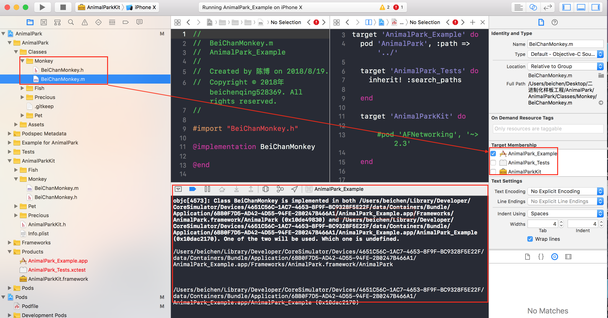

# 8.6 私有库二进制化-源码编译过程与资源引用


研究编译原理、深究编译过程以及其相关内容，在开发过程中是非常重要的一个环节，任何开发者都应该做深入研究。如果你看不懂相关代码，也不要觉得困难，很多代码的命名就能很清楚的表明它到底是干什么的，英语差的话翻译一下就好了。只是相对于英语好，底层代码也略懂的情况来说，学习成本比较高，不过这不应该是打败你的理由。


## iOS App 的编译过程


一般可以将编程语言分为两种，[编译语言](https://zh.wikipedia.org/wiki/編譯語言)和[直译式语言](https://en.wikipedia.org/wiki/Interpreted_language)。

* 像C++,Objective C都是编译语言。编译语言在执行的时候，必须先通过编译器生成机器码，机器码可以直接在CPU上执行，所以执行效率较高。

* 像JavaScript,Python都是直译式语言。直译式语言不需要经过编译的过程，而是在执行的时候通过一个中间的解释器将代码解释为CPU可以执行的代码。所以，较编译语言来说，直译式语言效率低一些，但是编写的更灵活，也就是为啥JS大法好。

* iOS开发目前的常用语言是：Objective和Swift。二者都是编译语言，换句话说都是需要编译才能执行的。二者的编译都是依赖于Clang(swift) + LLVM


在 iOS 开发的过程中，Xcode 为我们提供了非常完善的编译能力，正常情况下，我们只需要 Command + R 就可以将应用运行到设备上，即使打包也是一个相对愉快的过程

>写代码无法避开 Bug 一样，项目在编译的时候也会出现各种各样的错误，最痛苦的莫过于处理这些错误。其中的各种报错都不是我们在日常编程中所能接触的，而我们无法快速精准的定位错误并解决的唯一原因就是我们根本不知道在编译的时候都做了些什么，都需要些什么。就跟使用一个新的类，如果不去查看其代码，永远也无法知道它到底能干什么一样。


>一个 iOS 项目的编译过程是比较繁琐的，针对源代码、xib、framework 等都将进行一定的编译和操作，再加上使用 Cocoapods，会让整个过程更加复杂。将以 Swift 和 Objective-C 的不同角度来分析。
>


### 1.什么是编译

##### 在开始之前，必须知道什么是编译？为什么要进行编译？

>CPU 由上亿个晶体管组成，在运行的时候，单个晶体管只能根据电流的流通或关闭来确认两种状态，我们一般说 0 或 1，根据这种状态，人类创造了二进制，通过二进制编码我们可以表示所有的概念。但是，CPU 依然只能执行二进制代码。我们将一组二进制代码合并成一个指令或符号，创造了汇编语言，汇编语言以一种相对好理解的方式来编写，然后通过汇编过程生成 CPU 可以运行的二进制代码并运行在 CPU 上。

>但是使用汇编语言开发仍然是一个相对痛苦的过程，于是通过上述方式，c、c++、Java 等语言就一层一层的被发明出来。Objective-c 和 Swift 就是这样一个过程，他们的基础都是 c 和 c++。

当我们使用 Objective-c 和 Swift 编写代码后，想要代码能运行在 CPU 上，我们必须进行编译，将我们写好的代码编译为机器可以理解的二进制代码。


#####  1.1 LLVM  编译其实是一个用代码解释代码的过程

在 Objective-c 和 Swift 的编译过程中，用来解释代码的，就是 LLVM。点击可以看到 [LLVM](http://llvm.org) 的官方网站，在 Overview 的第一行就说明了 LLVM 到底是什么：

>The LLVM Project is a collection of modular and reusable compiler and toolchain technologies. Despite its name, LLVM has little to do with traditional virtual machines. The name “LLVM” itself is not an acronym; it is the full name of the project.
LLVM 项目是一个模块化、可重用的编译器、工具链技术的集合。尽管它的名字叫 LLVM，但它与传统虚拟机的关系并不大。“LLVM”这个名字本身不是一个缩略词; 它的全称是这个项目。
// LLVM 命名最早源自于底层虚拟机(Low Level Virtual Machine)的缩写。


LVVM 的作者写了一篇关于什么是 LLVM 的文章，详细的描述了 LLVM 的使用的技术点：[LLVM](http://www.aosabook.org/en/llvm.html)。


简单的说，LLVM 是一个项目，其作用就是提供一个广泛的工具，可以将任何高级语言的代码编译为任何架构的 CPU 都可以运行的机器代码。它将整个编译过程分类了三个模块：前端、公用优化器、后端。（这里不要去思考任何关于 web 前端和 service 后端的概念。）

 * 前端：对目标语言代码进行语法分析，语义分析，生成中间代码。在这个过程中，会进行类型检查，如果发现错误或者警告会标注出来在哪一行。我们在开发的过程中，其实 Xcode 也会使用前端工具对你的代码进行分析，并实时的检查出来某些错误。前端是针对特定语言的，如果需要一个新的语言被编译，只需要再写一个针对新语言的前端模块即可

 * 公用优化器：将生成的中间文件进行优化，去除冗余代码，进行结构优化。

 * 后端：后段将优化后的中间代码再次转换，变成汇编语言，并再次进行优化，最后将各个文件代码转换为机器代码并链接。链接是指将不同代码文件编译后的不同机器代码文件合并成一个可执行文件。

 * 目前 LLVM 并没有达到其目标（可以编译任何代码），但是这样的思路是很优秀的，在日常开发中，这种思路也会为我们提供不少的帮助

 
#### 1.2 clang 

clang 是 LLVM 的一个前端，它的作用是针对 C 语言家族的语言进行编译，像 c、c++、Objective-C。而 Swift 则自己实现了一个前端来进行 Swift 编译，优化器和后端依然是使用 LLVM 来完成，后面会专门对 Swift 语言的 前端编译流程进行分析。


### 2. iOS 项目编译过程简介

Xcode 在编译 iOS 项目的时候，使用的正是 LLVM，其实我们在编写代码以及调试的时候也在使用 LLVM 提供的功能。例如代码高亮（clang）、实时代码检查（clang）、代码提示（clang）、debug 断点调试（LLDB）。这些都是 LLVM 前端提供的功能，而对于后端来说，我们接触到的就是关于 arm64、armv7、armv7s 这些 CPU 架构了，记得之前还有 32 位架构处理器的时候，设定指定的编译的目标 CPU 架构就是一个比较痛苦的过程。


下面来简单的讲讲整个 iOS 项目的编译过程

```
我们的项目是一个 target，一个编译目标，它拥有自己的文件和编译规则，在我们的项目中可以存在多个子项目，这在编译的时候就导致了使用了 Cocoapods 或者拥有多个 target 的项目会先编译依赖库。这些库都和我们的项目编译流程一致。Cocoapods 的原理解释将在文章后面一部分进行解释。

```


1. 写入辅助文件：将项目的文件结构对应表、将要执行的脚本、项目依赖库的文件结构对应表写成文件，方便后面使用；并且创建一个 .app 包，后面编译后的文件都会被放入包中；
2. 运行预设脚本：Cocoapods 会预设一些脚本，当然你也可以自己预设一些脚本来运行。这些脚本都在 Build Phases 中可以看到；
3. 编译文件：针对每一个文件进行编译，生成可执行文件 Mach-O，这过程 LLVM 的完整流程，前端、优化器、后端；
4. 链接文件：将项目中的多个可执行文件合并成一个文件；
5. 拷贝资源文件：将项目中的资源文件拷贝到目标包；
6. 编译 storyboard 文件：storyboard 文件也是会被编译的；
7. 链接 storyboard 文件：将编译后的 storyboard 文件链接成一个文件；
8. 编译 Asset 文件：我们的图片如果使用 Assets.xcassets 来管理图片，那么这些图片将会被编译成机器码，除了 icon 和 launchImage；
9. 运行 Cocoapods 脚本：将在编译项目之前已经编译好的依赖库和相关资源拷贝到包中。
10. 生成 .app 包
11. 将 Swift 标准库拷贝到包中
12. 对包进行签名
13. 完成打包

上述流程中：2 - 9 步骤的数量和顺序并不固定，这个过程可以在 Build Phases 中指定。Phases：阶段、步骤。这个 Tab 的意思就是编译步骤。其实不仅我们的整个编译步骤和顺序可以被设定，包括编译过程中的编译规则（Build Rules）和具体步骤的参数（Build Settings），在对应的 Tab 都可以看到。关于整个编译流程的日志和设定，可以查看这篇文章：Build 过程，跟着它的步骤来查看自己的项目将有助于你理解整个编译流程。后面也会详细讲解这些内容。

```
查看对应位置的方法：在 Xcode 中选择自己的项目，在 targets 中选择自己的项目，就可以看到对应的 Tab 。

```

### 3 文件编译过程

Objective-C 的文件中，只有 .m 文件会被编译 .h 文件只是一个暴露外部接口的头文件，它的作用是为被编译的文件中的代码做简单的共享。下面拿一个单独的类文件进行分析。这些步骤中的每一步你都可以使用 clang 的命令来查看其进度，记住 clang 是一个命令行工具，它可以直接在终端中运行。这里我们使用 c 语言作为例子类进行分析，它的过程和 Objective-C 一样


##### 3.1 预处理

在我们的代码中会有很多 #import 宏，预处理的第一步就是将 import 引入的文件代码放入对应文件。

然后将自定义宏替换，例如我们定义了如下宏并进行了使用：

```
#define Button_Height 44
#define Button_Width 100

button.frame = CGRectMake(0, 0, Button_Width, Button_Height);

```

那么代码将被替换为：

```
button.frame = CGRectMake(0, 0, 44, 100);

```
按照这样的思路可以发现，在自定义宏的时候要格外小心，尤其是一些携带参数和功能的宏，这些宏也只是简单的直接替换代码，不能真的代替方法或函数，中间会有很多问题。

在将代码完全拆开后，将会对代码进行符号化，对于分析代码的代码 (clang)，我们写的代码就是一些字符串，为了后面给这些代码进行语法和语义分析，需要将我们的代码进行标记并符号化，例如一段 helloworld 的 c 代码：

```
#include <stdio.h>
int main(int argc, char *argv[])
{
    printf("Hello World!\n");
    return 0;
}

```

使用 clang 命令 ``clang -Xclang -dump-tokens helloworld.c ``转化后的代码如下（去掉了 stdio.h 中的内容）：

```
int 'int'    [StartOfLine]  Loc=<helloworld.c:2:1>
identifier 'main'    [LeadingSpace] Loc=<helloworld.c:2:5>
l_paren '('     Loc=<helloworld.c:2:9>
int 'int'       Loc=<helloworld.c:2:10>
identifier 'argc'    [LeadingSpace] Loc=<helloworld.c:2:14>
comma ','       Loc=<helloworld.c:2:18>
char 'char'  [LeadingSpace] Loc=<helloworld.c:2:20>
star '*'     [LeadingSpace] Loc=<helloworld.c:2:25>
identifier 'argv'       Loc=<helloworld.c:2:26>
l_square '['        Loc=<helloworld.c:2:30>
r_square ']'        Loc=<helloworld.c:2:31>
r_paren ')'     Loc=<helloworld.c:2:32>
l_brace '{'  [StartOfLine]  Loc=<helloworld.c:3:1>
identifier 'printf'  [StartOfLine] [LeadingSpace]   Loc=<helloworld.c:4:2>
l_paren '('     Loc=<helloworld.c:4:8>
string_literal '"Hello World!\n"'       Loc=<helloworld.c:4:9>
r_paren ')'     Loc=<helloworld.c:4:25>
semi ';'        Loc=<helloworld.c:4:26>
return 'return'  [StartOfLine] [LeadingSpace]   Loc=<helloworld.c:5:2>
numeric_constant '0'     [LeadingSpace] Loc=<helloworld.c:5:9>
semi ';'        Loc=<helloworld.c:5:10>
r_brace '}'  [StartOfLine]  Loc=<helloworld.c:6:1>
eof ''      Loc=<helloworld.c:6:2>


```

这里，每一个符号都会标记出来其位置，这个位置是宏展开之前的位置，这样后面如果发现报错，就可以正确的提示错误位置了。针对 Objective-C 代码，我们只需要转化对应的 .m 文件就可以查看。


##### 3.2 语意和语法分析

* 3.2.1 AST  AST的详细解释 : [Introduction to the Clang AST](http://clang.llvm.org/docs/IntroductionToTheClangAST.html)

对代码进行标记之后，其实就可以对代码进行分析，但是这样分析起来的过程会比较复杂。于是 clang 又进行了一步转换：将之前的标记流转换为一颗抽象语法树（abstract syntax tree – AST）。

```
`-FunctionDecl 0x7f8eaf834bb0 <helloworld.c:2:1, line:6:1> line:2:5 main 'int (int, char **)'
  |-ParmVarDecl 0x7f8eaf8349b8 <col:10, col:14> col:14 argc 'int'
  |-ParmVarDecl 0x7f8eaf834aa0 <col:20, col:31> col:26 argv 'char **':'char **'
  `-CompoundStmt 0x7f8eaf834dd8 <line:3:1, line:6:1>
    |-CallExpr 0x7f8eaf834d40 <line:4:2, col:25> 'int'
    | |-ImplicitCastExpr 0x7f8eaf834d28 <col:2> 'int (*)(const char *, ...)' <FunctionToPointerDecay>
    | | `-DeclRefExpr 0x7f8eaf834c68 <col:2> 'int (const char *, ...)' Function 0x7f8eae836d78 'printf' 'int (const char *, ...)'
    | `-ImplicitCastExpr 0x7f8eaf834d88 <col:9> 'const char *' <BitCast>
    |   `-ImplicitCastExpr 0x7f8eaf834d70 <col:9> 'char *' <ArrayToPointerDecay>
    |     `-StringLiteral 0x7f8eaf834cc8 <col:9> 'char [14]' lvalue "Hello World!\n"
    `-ReturnStmt 0x7f8eaf834dc0 <line:5:2, col:9>
      `-IntegerLiteral 0x7f8eaf834da0 <col:9> 'int' 0


```


这是一个 main 方法的抽象语法树，可以看到树顶是 FunctionDecl：方法声明（Function Declaration）

```
这里因为截取了部分代码，其实并不是整个树的树顶。真正的树顶描述应该是：TranslationUnitDecl。

```


然后是两个 ParmVarDecl：参数声明。

接着下一层是 CompoundStmt：说明下面有一组复合的声明语句，指的是我们的 main 方法里面所使用到的所有代码。

再到里面就是每一行代码的使用，方法的调用，传递的参数，以及返回。在实际应用中还会有变量的声明、操作符的使用等。

* 3.2.2 静态分析

有了这样的语法树，对代码的分析就会简单许多。对这棵树进行遍历分析，包括类型检查、实现检查（某个类是否存在某个方法）、变量使用，还会有一些复杂的检查，例如在 Objective-C 中，给某一个对象发送消息（调用某个方法），检查这个对象的类是否声明这个方法（但并不会去检查这个方法是否实现，这个错误是在运行时进行检查的），如果有什么错误就会进行提示。因此可见，Xcode 对 clang 做了非常深度的集成，在编写代码的过程中它就会使用 clang 来对你的代码进行分析，并及时的对你的代码错误进行提示。


##### 3.3 生成 LLVM 代码

当确认代码没有问题后（静态分析可分析出来的问题），前端就将进入最后一步：生成 LLVM 代码，并将代码递交给优化器。

使用命令 ``clang -S -emit-llvm helloworld.c -o helloworld.ll`` 将生成 LLVM IR。

>The most important aspect of its design is the LLVM Intermediate Representation (IR), which is the form it uses to represent code in the compiler. LLVM IR is designed to host mid-level analyses and transformations that you find in the optimizer section of a compiler. It was designed with many specific goals in mind, including supporting lightweight runtime optimizations, cross-function/interprocedural optimizations, whole program analysis, and aggressive restructuring transformations, etc. The most important aspect of it, though, is that it is itself defined as a first class language with well-defined semantics.
其设计的最重要的部分是 LLVM 中间表示（IR），它是一种在编译器中表示代码的形式。LLVM IR 旨在承载在编译器的优化器中间的分析和转换。它的设计考虑了许多特定的目标，包括支持轻量级运行时优化，跨功能/进程间优化，整个程序分析和积极的重组转换等等。但它最重要的方面是它本身被定义为具有明确定义的语义的第一类语言。


例如我们上面的代码将会被生成为：

```
; ModuleID = 'helloworld.c'
source_filename = "helloworld.c"
target datalayout = "e-m:o-i64:64-f80:128-n8:16:32:64-S128"
target triple = "x86_64-apple-macosx10.12.0"

@.str = private unnamed_addr constant [14 x i8] c"Hello World!\0A\00", align 1

; Function Attrs: nounwind ssp uwtable
define i32 @main(i32, i8**) #0 {
  %3 = alloca i32, align 4
  %4 = alloca i32, align 4
  %5 = alloca i8**, align 8
  store i32 0, i32* %3, align 4
  store i32 %0, i32* %4, align 4
  store i8** %1, i8*** %5, align 8
  %6 = call i32 (i8*, ...) @printf(i8* getelementptr inbounds ([14 x i8], [14 x i8]* @.str, i32 0, i32 0))
  ret i32 0
}

declare i32 @printf(i8*, ...) #1

attributes #0 = { nounwind ssp uwtable "correctly-rounded-divide-sqrt-fp-math"="false" "disable-tail-calls"="false" "less-precise-fpmad"="false" "no-frame-pointer-elim"="true" "no-frame-pointer-elim-non-leaf" "no-infs-fp-math"="false" "no-jump-tables"="false" "no-nans-fp-math"="false" "no-signed-zeros-fp-math"="false" "stack-protector-buffer-size"="8" "target-cpu"="penryn" "target-features"="+cx16,+fxsr,+mmx,+sse,+sse2,+sse3,+sse4.1,+ssse3,+x87" "unsafe-fp-math"="false" "use-soft-float"="false" }
attributes #1 = { "correctly-rounded-divide-sqrt-fp-math"="false" "disable-tail-calls"="false" "less-precise-fpmad"="false" "no-frame-pointer-elim"="true" "no-frame-pointer-elim-non-leaf" "no-infs-fp-math"="false" "no-nans-fp-math"="false" "no-signed-zeros-fp-math"="false" "stack-protector-buffer-size"="8" "target-cpu"="penryn" "target-features"="+cx16,+fxsr,+mmx,+sse,+sse2,+sse3,+sse4.1,+ssse3,+x87" "unsafe-fp-math"="false" "use-soft-float"="false" }

!llvm.module.flags = !{!0}
!llvm.ident = !{!1}

!0 = !{i32 1, !"PIC Level", i32 2}
!1 = !{!"Apple LLVM version 8.1.0 (clang-802.0.42)"}


```


其实还是能实现我们功能的代码，在这一步，所有 LLVM 前端支持的语言都将会被转换成这样的代码，主要是为了后面的工作可以共用。下面就是 LVVM 中的优化器的工作。
在这里简单介绍一些 LLVM IR 的指令：

1. %：局部变量
2. @：全局变量
3. alloca：分配内存堆栈
4. i32：32 位的整数
5. i32**：一个指向 32 位 int 值的指针的指针
6. align 4：向 4 个字节对齐，即便数据没有占用 4 个字节，也要为其分配四个字节
7. call：调用


##### 3.4 优化

上面的代码是没有进行优化过的，在语言转换的过程中，有些代码是可以被优化以提升执行效率的。使用命令 ``clang -O3 -S -emit-llvm helloworld.c -o helloworld.ll``，其实和上面的命令的区别只有 ``-O3`` 而已，注意，这里是大写字母 O 而不是数字 0。优化后的代码如下：

```
; ModuleID = 'helloworld.c'
source_filename = "helloworld.c"
target datalayout = "e-m:o-i64:64-f80:128-n8:16:32:64-S128"
target triple = "x86_64-apple-macosx10.12.0"

@str = private unnamed_addr constant [13 x i8] c"Hello World!\00"

; Function Attrs: nounwind ssp uwtable
define i32 @main(i32, i8** nocapture readnone) local_unnamed_addr #0 {
  %3 = tail call i32 @puts(i8* getelementptr inbounds ([13 x i8], [13 x i8]* @str, i64 0, i64 0))
  ret i32 0
}

; Function Attrs: nounwind
declare i32 @puts(i8* nocapture readonly) #1

attributes #0 = { nounwind ssp uwtable "correctly-rounded-divide-sqrt-fp-math"="false" "disable-tail-calls"="false" "less-precise-fpmad"="false" "no-frame-pointer-elim"="true" "no-frame-pointer-elim-non-leaf" "no-infs-fp-math"="false" "no-jump-tables"="false" "no-nans-fp-math"="false" "no-signed-zeros-fp-math"="false" "stack-protector-buffer-size"="8" "target-cpu"="penryn" "target-features"="+cx16,+fxsr,+mmx,+sse,+sse2,+sse3,+sse4.1,+ssse3,+x87" "unsafe-fp-math"="false" "use-soft-float"="false" }
attributes #1 = { nounwind }

!llvm.module.flags = !{!0}
!llvm.ident = !{!1}

!0 = !{i32 1, !"PIC Level", i32 2}
!1 = !{!"Apple LLVM version 8.1.0 (clang-802.0.42)"}


```


可以看到，即使是最简单的 helloworld 代码，也会被优化。这一步骤的优化是非常重要的，很多直接转换来的代码是不合适且消耗内存的，因为是直接转换，所以必然会有这样的问题，而优化放在这一步的好处在于前端不需要考虑任何优化过程，减少了前端的开发工作。


##### 3.5 生成目标文件


下面就是后端的工作了，将优化过的代码根据不同架构的 CPU 转化生成汇编代码，再生成对应的可执行文件，这样对应的 CPU 就可以执行了。

使用命令 ``clang -S -o - helloworld.c | open -f`` 可以查看生成的汇编代码：


```
.section __TEXT,__text,regular,pure_instructions 
.macosx_version_min 10, 12 
.globl _main 
.p2align 4, 0x90 
_main: ## @main 
.cfi_startproc
```

## BB#0:

```
pushq   %rbp

```

```
Ltmp0: 
.cfi_def_cfa_offset 16 
Ltmp1: 
.cfi_offset %rbp, -16 
movq %rsp, %rbp 
Ltmp2: 
.cfi_def_cfa_register %rbp 
subq 32,leaqL.str(movl
0, -4(%rbp) 
movl %edi, -8(%rbp) 
movq %rsi, -16(%rbp) 
movq %rax, %rdi 
movb 0,callqprintfxorlmovlmovladdq
32, %rsp 
popq %rbp 
retq 
.cfi_endproc


```

```
.section    __TEXT,__cstring,cstring_literals

```
```
L_.str: ## @.str 
.asciz “Hello World!\n”

.subsections_via_symbols 

```

注意代码中的 .section 指令，它指定了接下来会执行的代码段。

##### 3.6 可执行文件


在最后，LLVM 将会把这些汇编代码输出成二进制的可执行文件，使用命令 ``clang helloworld.c -o helloworld.out`` 即可查看，``-o helloworld.out`` 如果不指定，将会被默认指定为 a.out。

可执行文件会有多个部分，对应了汇编指令中的 ``.section``，它的名字也叫做 section，每个 section 都会被转换进某个 segment 里。这种方式用来区分不同功能的代码。将相同属性的 section 集合在一起，就是一个 segment。

使用 otool 工具可以查看生成的可执行文件的 section 和 segment：

```
xcrun size -x -l -m helloworld.out
```

```
Segment __PAGEZERO: 0x100000000 (vmaddr 0x0 fileoff 0)
Segment __TEXT: 0x1000 (vmaddr 0x100000000 fileoff 0)
    Section __text: 0x34 (addr 0x100000f50 offset 3920)
    Section __stubs: 0x6 (addr 0x100000f84 offset 3972)
    Section __stub_helper: 0x1a (addr 0x100000f8c offset 3980)
    Section __cstring: 0xe (addr 0x100000fa6 offset 4006)
    Section __unwind_info: 0x48 (addr 0x100000fb4 offset 4020)
    total 0xaa
Segment __DATA: 0x1000 (vmaddr 0x100001000 fileoff 4096)
    Section __nl_symbol_ptr: 0x10 (addr 0x100001000 offset 4096)
    Section __la_symbol_ptr: 0x8 (addr 0x100001010 offset 4112)
    total 0x18
Segment __LINKEDIT: 0x1000 (vmaddr 0x100002000 fileoff 8192)
total 0x100003000

```

上面的代码中，每个 segment 的意义也不一样：

1. ``__PAGEZERO`` segment 它的大小为 4GB。这 4GB 并不是文件的真实大小，但是规定了进程地址空间的前 4GB 被映射为 不可执行、不可写和不可读。
2. ``__TEXT`` segment 包含了被执行的代码。它被以只读和可执行的方式映射。进程被允许执行这些代码，但是不能修改。
3. ``__DATA`` segment 以可读写和不可执行的方式映射。它包含了将会被更改的数据。
4. ``__LINKEDIT`` segment 指出了 link edit 表（包含符号和字符串的动态链接器表）的地址，里面包含了加载程序的元数据，例如函数的名称和地址。


#####  Swift 文件 的编译过程


在 [Swift 编译器结构](https://swift.org/compiler-stdlib/#compiler-architecture) 的官方文档中描述了 Swift 编译器是如何工作的，分为如下步骤：

1. 解析：解析器是一个简单的递归下降解析器（在 lib / Parse 中实现），带有集成的手动编码词法分析器。解析器负责生成没有任何语义或类型信息的抽象语法树（AST），并针对输入源的语法问题发出警告或错误。
2. 语意分析：语义分析（在 lib / Sema 中实现）负责解析 AST 并将其转换为格式良好的完全检查形式的 AST，并在源代码中发出语义问题的警告或错误。语义分析包括类型推断，如果成功，则所得到的代码是类型检查安全的 AST 。
3. **Clang导入器：**Clang导入器（在 lib / ClangImporter 中实现）导入Clang模块，并将它们导出的 C 或 Objective-C API 映射到相应的 Swift API中。结果导入的 AST 可以通过语义分析来引用。
4. **SIL生成：**Swift中间语言（Swift Intermediate Language，简称SIL）是一种高级的，Swift特有的中间语言，适用于 Swift 代码的进一步分析和优化。SIL 生成阶段（在 lib / SILGen 中实现）将类型检查的 AST 降低到所谓的 “原始” SIL。SIL的设计描述在 docs/ SIL.rst 中可以看到。
5. SIL优化：在SIL优化（在 lib/Analysis，lib/ ARC，lib/LoopTransforms，和 lib/Transforms 中实现）执行额外的高级别，Swift 特有的优化的程序，包括（例如）自动引用计数优化，虚拟化和通用专业化。
6. **LLVM IR生成：**IR生成（在 lib/IRGen 中实现）将 SIL 降到 LLVM IR，此时LLVM可以继续对其进行优化并生成机器码。

在 LLVM IR 生成后，就会和 3.3 的结果一致了，后面的事情就是优化器和 LLVM 后端进行的，所有 LLVM 支持的语言都是一样的。

下面将详细解释以下每一步的操作，首先创建一个 swift 文件 swiftFile.swift ：

```
func double(number: Int) {
    print(number*2)
}

```


在终端里，我们使用 ``swiftc`` 来调用 swift 的编译器，命令 ``swiftc -help`` 可以看到其支持的命令。


* 3.7.1 解析 使用命令 ``swiftc -dump-parse swiftFile.swift`` 可以查看初步解析后的 AST：

```

(source_file
  (func_decl "double(number:)"
    (parameter_list
      (parameter "number" apiName=number))
    (brace_stmt
      (call_expr type='<null>' arg_labels=_:
        (unresolved_decl_ref_expr type='<null>' name=print specialized=no function_ref=unapplied)
        (paren_expr type='<null>'
          (sequence_expr type='<null>'
            (declref_expr type='<null>' decl=swiftFile.(file).func decl.number@swiftFile.swift:1:13 function_ref=unapplied specialized=yes)
            (unresolved_decl_ref_expr type='<null>' name=* specialized=no function_ref=unapplied)
            (integer_literal_expr type='<null>' value=2)))))))


```


这是 Swift 编辑器自己使用的 AST，相对于 clang 的 AST 只是符号不一致。它也有 ``func_decl`` 相较于 clang 的 ``FunctionDecl``。这里的参数表现方式不一样，clang 的参数是在外层的，这里使用了 ``parameter_list`` 来做了一个分叉，包含了 ``parameter``。不过再改变，其设计原则也不会变，都是为了更加方便的使用一颗代码树来分析代码。这里所有的 type 都是 <null>，而且中间的很多操作都是未定义的，比如说 *，说明还没有做过类型检查，这需要下在一步中操作。


* 3.7.2 语意分析  使用命令 ``swiftc -dump-ast swiftFile.swift`` 可以查看进行过类型检查后的 AST：

```
(source_file
  (func_decl "double(number:)" interface type='(Int) -> ()' access=internal
    (parameter_list
      (parameter "number" apiName=number type='Int' interface type='Int'))
    (brace_stmt
      (call_expr type='()' location=swiftFile.swift:2:5 range=[swiftFile.swift:2:5 - line:2:19] nothrow arg_labels=_:
        (declref_expr type='(Any..., String, String) -> ()' location=swiftFile.swift:2:5 range=[swiftFile.swift:2:5 - line:2:5] decl=Swift.(file).print(_:separator:terminator:) function_ref=single specialized=no)
        (tuple_shuffle_expr implicit type='(Any..., separator: String, terminator: String)' location=swiftFile.swift:2:17 range=[swiftFile.swift:2:10 - line:2:19] source_is_scalar elements=[-2, -1, -1] variadic_sources=[0] default_args_owner=Swift.(file).print(_:separator:terminator:)
          (paren_expr type='Any' location=swiftFile.swift:2:17 range=[swiftFile.swift:2:10 - line:2:19]
            (erasure_expr implicit type='Any' location=swiftFile.swift:2:17 range=[swiftFile.swift:2:11 - line:2:18]
              (binary_expr type='Int' location=swiftFile.swift:2:17 range=[swiftFile.swift:2:11 - line:2:18] nothrow
                (declref_expr type='(Int, Int) -> Int' location=swiftFile.swift:2:17 range=[swiftFile.swift:2:17 - line:2:17] decl=Swift.(file).* function_ref=unapplied specialized=no)
                (tuple_expr implicit type='(Int, Int)' location=swiftFile.swift:2:11 range=[swiftFile.swift:2:11 - line:2:18]
                  (declref_expr type='Int' location=swiftFile.swift:2:11 range=[swiftFile.swift:2:11 - line:2:11] decl=swiftFile.(file).func decl.number@swiftFile.swift:1:13 function_ref=unapplied specialized=no)
                  (call_expr implicit type='Int' location=swiftFile.swift:2:18 range=[swiftFile.swift:2:18 - line:2:18] nothrow arg_labels=_builtinIntegerLiteral:
                    (constructor_ref_call_expr implicit type='(Int2048) -> Int' location=swiftFile.swift:2:18 range=[swiftFile.swift:2:18 - line:2:18] nothrow
                      (declref_expr implicit type='(Int.Type) -> (Int2048) -> Int' location=swiftFile.swift:2:18 range=[swiftFile.swift:2:18 - line:2:18] decl=Swift.(file).Int.init(_builtinIntegerLiteral:) function_ref=single specialized=no)
                      (type_expr implicit type='Int.Type' location=swiftFile.swift:2:18 range=[swiftFile.swift:2:18 - line:2:18] typerepr='Int'))
                    (tuple_expr implicit type='(_builtinIntegerLiteral: Int2048)' location=swiftFile.swift:2:18 range=[swiftFile.swift:2:18 - line:2:18] names=_builtinIntegerLiteral
                      (integer_literal_expr type='Int2048' location=swiftFile.swift:2:18 range=[swiftFile.swift:2:18 - line:2:18] value=2))))))))))))


```


仔细观察这一步和上一步的区别，我们所有的 ``type`` 都被填充了，这就是进行过类型检查后的 AST，这个时候编译器就可以对源代码中的语意问题进行检查并对错误或者警告进行提示。

检查后的 AST 可以完整表述我们的代码，有了完整的类型和操作。例如这里的 ``declref_expr`` 、``tuple_shuffle_expr`` 指明了我们的打印方法：

``public func print(_ items: Any..., separator: String = default, terminator: String = default)``

``paren_expr``、``erasure_expr``、``binary_expr`` 指定了我们传入 ``print()`` 方法的值类型。

``declref_expr type='(Int, Int) -> Int'`` 指明了我们的 ``* ``方法。

``tuple_expr implicit type='(Int, Int)'`` 指明了 ``*`` 方法的参数元组。

还有后面的标识符说明了我们的各个参数、使用方法、返回值以及各种值的类型。


* 3.7.3 clang 导入器

这一步骤是进行 c 和 Objective-C 的 API 映射


* 3.7.4 SIL（Swift中间语言 Swift Intermediate Language，简称SIL）生成

使用命令 ``swiftc -emit-sil swiftFile.swift | open -f`` 可以查看生成的 SIL 代码，输出比较长，贴出部分来查看：

```

sil_scope 1 {  parent @main : $@convention(c) (Int32, UnsafeMutablePointer<Optional<UnsafeMutablePointer<Int8>>>) -> Int32 }

// main
sil @main : $@convention(c) (Int32, UnsafeMutablePointer<Optional<UnsafeMutablePointer<Int8>>>) -> Int32 {
bb0(%0 : $Int32, %1 : $UnsafeMutablePointer<Optional<UnsafeMutablePointer<Int8>>>):
  %2 = integer_literal $Builtin.Int32, 0, scope 1 // user: %3
  %3 = struct $Int32 (%2 : $Builtin.Int32), scope 1 // user: %4
  return %3 : $Int32, scope 1                     // id: %4
} // end sil function 'main'

sil_scope 2 { loc "swiftFile.swift":1:6 parent @_TF9swiftFile6doubleFT6numberSi_T_ : $@convention(thin) (Int) -> () }
sil_scope 3 { loc "swiftFile.swift":3:1 parent 2 }

// double(number : Int) -> ()
sil hidden @_TF9swiftFile6doubleFT6numberSi_T_ : $@convention(thin) (Int) -> () {
// %0                                             // users: %11, %1
bb0(%0 : $Int):
  // 定义了方法，以及参数 $0 就是参数 Int
  debug_value %0 : $Int, let, name "number", argno 1, loc "swiftFile.swift":1:13, scope 2 // id: %1
  // function_ref print([Any], separator : String, terminator : String) -> ()
  // Print 方法
  %2 = function_ref @_TFs5printFTGSaP__9separatorSS10terminatorSS_T_ : $@convention(thin) (@owned Array<Any>, @owned String, @owned String) -> (), loc "swiftFile.swift":2:5, scope 3 // user: %23
  // 字符 1
  %3 = integer_literal $Builtin.Word, 1, loc "swiftFile.swift":2:17, scope 3 // user: %5
  // function_ref specialized _allocateUninitializedArray<A> (Builtin.Word) -> ([A], Builtin.RawPointer)
  // 一个数组的初始化方法，里面包含其值和值对应的指针
  %4 = function_ref @_TTSgq5P____TFs27_allocateUninitializedArrayurFBwTGSax_Bp_ : $@convention(thin) (Builtin.Word) -> (@owned Array<Any>, Builtin.RawPointer), loc "swiftFile.swift":2:17, scope 3 // user: %5
  // 使用一个默认字符 1 初始化这个值
  %5 = apply %4(%3) : $@convention(thin) (Builtin.Word) -> (@owned Array<Any>, Builtin.RawPointer), loc "swiftFile.swift":2:17, scope 3 // users: %6, %7
  // 拿到了数组
  %6 = tuple_extract %5 : $(Array<Any>, Builtin.RawPointer), 0, loc "swiftFile.swift":2:17, scope 3 // user: %23
  // 拿到了数组的指针
  %7 = tuple_extract %5 : $(Array<Any>, Builtin.RawPointer), 1, loc "swiftFile.swift":2:17, scope 3 // user: %8
  // 拿到指针的地址
  %8 = pointer_to_address %7 : $Builtin.RawPointer to [strict] $*Any, loc "swiftFile.swift":2:17, scope 3 // user: %9
  // 使用指针的指向地址初始化一个存在的地址
  %9 = init_existential_addr %8 : $*Any, $Int, loc "swiftFile.swift":2:17, scope 3 // user: %18
  // 数字 2
  %10 = integer_literal $Builtin.Int64, 2, loc "swiftFile.swift":2:18, scope 3 // user: %13
  // number
  %11 = struct_extract %0 : $Int, #Int._value, loc "swiftFile.swift":2:17, scope 3 // user: %13
  // 数字 -1，在 smul_with_overflow_Int64 方法中传入，后修改，用来做操作成功失败的标识
  %12 = integer_literal $Builtin.Int1, -1, loc "swiftFile.swift":2:17, scope 3 // user: %13
  // 做乘法
  %13 = builtin "smul_with_overflow_Int64"(%11 : $Builtin.Int64, %10 : $Builtin.Int64, %12 : $Builtin.Int1) : $(Builtin.Int64, Builtin.Int1), loc "swiftFile.swift":2:17, scope 3 // users: %15, %14
  // 获取结果
  %14 = tuple_extract %13 : $(Builtin.Int64, Builtin.Int1), 0, loc "swiftFile.swift":2:17, scope 3 // user: %17
  // 获取操作结果：成功或者失败
  %15 = tuple_extract %13 : $(Builtin.Int64, Builtin.Int1), 1, loc "swiftFile.swift":2:17, scope 3 // user: %16
  // 判定是成功还是失败
  cond_fail %15 : $Builtin.Int1, loc "swiftFile.swift":2:17, scope 3 // id: %16
  // 将获取来的结果转为一个 struct
  %17 = struct $Int (%14 : $Builtin.Int64), loc "swiftFile.swift":2:17, scope 3 // user: %18
  // 将结果保存到 %9 的地址，这样 %6 的值就将是这个值
  store %17 to %9 : $*Int, loc "swiftFile.swift":2:17, scope 3 // id: %18
  // function_ref (print([Any], separator : String, terminator : String) -> ()).(default argument 1)
  // 获取第二个参数 `separator` 的默认值方法
  %19 = function_ref @_TIFs5printFTGSaP__9separatorSS10terminatorSS_T_A0_ : $@convention(thin) () -> @owned String, loc "swiftFile.swift":2:17, scope 3 // user: %20
  // 调用获取第二个参数 `separator` 的默认值方法
  %20 = apply %19() : $@convention(thin) () -> @owned String, loc "swiftFile.swift":2:17, scope 3 // user: %23
  // function_ref (print([Any], separator : String, terminator : String) -> ()).(default argument 2)
  // 获取第三个参数 `terminator` 的默认值方法
  %21 = function_ref @_TIFs5printFTGSaP__9separatorSS10terminatorSS_T_A1_ : $@convention(thin) () -> @owned String, loc "swiftFile.swift":2:17, scope 3 // user: %22
  // 调用获取第三个参数 `terminator` 的默认值方法
  %22 = apply %21() : $@convention(thin) () -> @owned String, loc "swiftFile.swift":2:17, scope 3 // user: %23
  // 调用 print 方法 %6 就是运算后的结果
  %23 = apply %2(%6, %20, %22) : $@convention(thin) (@owned Array<Any>, @owned String, @owned String) -> (), loc "swiftFile.swift":2:19, scope 3
  // 创建一个空元组
  %24 = tuple (), loc "swiftFile.swift":3:1, scope 3 // user: %25
  // 返回这个元组
  return %24 : $(), loc "swiftFile.swift":3:1, scope 3 // id: %25
} // end sil function '_TF9swiftFile6doubleFT6numberSi_T_'


```

SIL 中间语言看起来就顺眼多了，居然还有注释（英文注释为原注释，中文注释是我后来加的）。在原文件中是没有 ``main`` 的，这里可以看到，给代码中添加了 ``main`` 函数，运行入口依然是 ``main`` 函数。这里可以解释 ``Xcode Playground`` 的实现原理，可以不用考虑 ``main`` 函数，它在编译期会被添加。

和 LLVM ``IR`` 一样 ``% ``是局部变量，``@`` 是全局变量。代码中有一些是 SIL 的基础语法，还有一些是自己定义的方法，可以直接在文件中搜索得到。不难发现，这些代码非常多，有一些冗余代码，在下一步将会对这些代码进行优化。

* 3.7.4 SIL 优化.  使用命令 ``swiftc -emit-silgen swiftFile.swift | open -f`` 可以看到优化后的代码：

```
sil_stage raw

import Builtin
import Swift
import SwiftShims

sil_scope 1 {  parent @main : $@convention(c) (Int32, UnsafeMutablePointer<Optional<UnsafeMutablePointer<Int8>>>) -> Int32 }

// main
sil @main : $@convention(c) (Int32, UnsafeMutablePointer<Optional<UnsafeMutablePointer<Int8>>>) -> Int32 {
bb0(%0 : $Int32, %1 : $UnsafeMutablePointer<Optional<UnsafeMutablePointer<Int8>>>):
  %2 = integer_literal $Builtin.Int32, 0, scope 1 // user: %3
  %3 = struct $Int32 (%2 : $Builtin.Int32), scope 1 // user: %4
  return %3 : $Int32, scope 1                     // id: %4
} // end sil function 'main'

sil_scope 2 { loc "swiftFile.swift":1:6 parent @_TF9swiftFile6doubleFT6numberSi_T_ : $@convention(thin) (Int) -> () }
sil_scope 3 { loc "swiftFile.swift":3:1 parent 2 }

// double(number : Int) -> ()
sil hidden @_TF9swiftFile6doubleFT6numberSi_T_ : $@convention(thin) (Int) -> () {
// %0                                             // users: %15, %1
bb0(%0 : $Int):
  // 定义了方法
  debug_value %0 : $Int, let, name "number", argno 1, loc "swiftFile.swift":1:13, scope 2 // id: %1
  // function_ref print([Any], separator : String, terminator : String) -> ()
  // print 方法
  %2 = function_ref @_TFs5printFTGSaP__9separatorSS10terminatorSS_T_ : $@convention(thin) (@owned Array<Any>, @owned String, @owned String) -> (), loc "swiftFile.swift":2:5, scope 3 // user: %21
  // 初始化一个默认值
  %3 = integer_literal $Builtin.Word, 1, loc "swiftFile.swift":2:17, scope 3 // user: %5
  // function_ref _allocateUninitializedArray<A> (Builtin.Word) -> ([A], Builtin.RawPointer)
  // 存储数据方法
  %4 = function_ref @_TFs27_allocateUninitializedArrayurFBwTGSax_Bp_ : $@convention(thin) <τ_0_0> (Builtin.Word) -> (@owned Array<τ_0_0>, Builtin.RawPointer), loc "swiftFile.swift":2:17, scope 3 // user: %5
  // 使用默认值初始化值
  %5 = apply %4<Any>(%3) : $@convention(thin) <τ_0_0> (Builtin.Word) -> (@owned Array<τ_0_0>, Builtin.RawPointer), loc "swiftFile.swift":2:17, scope 3 // users: %7, %6
  // 获取值
  %6 = tuple_extract %5 : $(Array<Any>, Builtin.RawPointer), 0, loc "swiftFile.swift":2:17, scope 3 // user: %21
  // 获取值对应的指针
  %7 = tuple_extract %5 : $(Array<Any>, Builtin.RawPointer), 1, loc "swiftFile.swift":2:17, scope 3 // user: %8
  // 获取指针指向的地址
  %8 = pointer_to_address %7 : $Builtin.RawPointer to [strict] $*Any, loc "swiftFile.swift":2:17, scope 3 // user: %9
  // 根据指针指向的地址初始化一个地址
  %9 = init_existential_addr %8 : $*Any, $Int, loc "swiftFile.swift":2:17, scope 3 // user: %16
  // function_ref * infix(Int, Int) -> Int
  // 乘法方法
  %10 = function_ref @_TFsoi1mFTSiSi_Si : $@convention(thin) (Int, Int) -> Int, loc "swiftFile.swift":2:17, scope 3 // user: %15
  // function_ref Int.init(_builtinIntegerLiteral : Builtin.Int2048) -> Int
  // 一个 Int2048 到 Int 的转换类型
  %11 = function_ref @_TFSiCfT22_builtinIntegerLiteralBi2048__Si : $@convention(method) (Builtin.Int2048, @thin Int.Type) -> Int, loc "swiftFile.swift":2:18, scope 3 // user: %14
  // 设定目标类型
  %12 = metatype $@thin Int.Type, loc "swiftFile.swift":2:18, scope 3 // user: %14
  // Int2048 类型的数字 2
  %13 = integer_literal $Builtin.Int2048, 2, loc "swiftFile.swift":2:18, scope 3 // user: %14
  // 转换数字 2 为 Int 类型
  %14 = apply %11(%13, %12) : $@convention(method) (Builtin.Int2048, @thin Int.Type) -> Int, loc "swiftFile.swift":2:18, scope 3 // user: %15
  // 调用乘法
  %15 = apply %10(%0, %14) : $@convention(thin) (Int, Int) -> Int, loc "swiftFile.swift":2:17, scope 3 // user: %16
  // 存入结果数据
  store %15 to [trivial] %9 : $*Int, loc "swiftFile.swift":2:17, scope 3 // id: %16
  // function_ref (print([Any], separator : String, terminator : String) -> ()).(default argument 1)
  // 获取第二个参数 `separator` 的默认值方法
  %17 = function_ref @_TIFs5printFTGSaP__9separatorSS10terminatorSS_T_A0_ : $@convention(thin) () -> @owned String, loc "swiftFile.swift":2:17, scope 3 // user: %18
  // 调用获取第二个参数 `separator` 的默认值方法
  %18 = apply %17() : $@convention(thin) () -> @owned String, loc "swiftFile.swift":2:17, scope 3 // user: %21
  // function_ref (print([Any], separator : String, terminator : String) -> ()).(default argument 2)
  // 获取第三个参数 `terminator` 的默认值方法
  %19 = function_ref @_TIFs5printFTGSaP__9separatorSS10terminatorSS_T_A1_ : $@convention(thin) () -> @owned String, loc "swiftFile.swift":2:17, scope 3 // user: %20
  // 调用获取第三个参数 `terminator` 的默认值方法
  %20 = apply %19() : $@convention(thin) () -> @owned String, loc "swiftFile.swift":2:17, scope 3 // user: %21
  // 调用 print 方法
  %21 = apply %2(%6, %18, %20) : $@convention(thin) (@owned Array<Any>, @owned String, @owned String) -> (), loc "swiftFile.swift":2:19, scope 3
  // 创建一个空元组
  %22 = tuple (), loc "swiftFile.swift":3:1, scope 3 // user: %23
  // 返回元组
  return %22 : $(), loc "swiftFile.swift":3:1, scope 3 // id: %23
} // end sil function '_TF9swiftFile6doubleFT6numberSi_T_'


// print([Any], separator : String, terminator : String) -> ()
sil [noinline] [_semantics "stdlib_binary_only"] @_TFs5printFTGSaP__9separatorSS10terminatorSS_T_ : $@convention(thin) (@owned Array<Any>, @owned String, @owned String) -> ()


// _allocateUninitializedArray<A> (Builtin.Word) -> ([A], Builtin.RawPointer)
sil [fragile] [always_inline] @_TFs27_allocateUninitializedArrayurFBwTGSax_Bp_ : $@convention(thin) <τ_0_0> (Builtin.Word) -> (@owned Array<τ_0_0>, Builtin.RawPointer)


// * infix(Int, Int) -> Int
sil [transparent] [fragile] @_TFsoi1mFTSiSi_Si : $@convention(thin) (Int, Int) -> Int


// Int.init(_builtinIntegerLiteral : Builtin.Int2048) -> Int
sil [transparent] [fragile] @_TFSiCfT22_builtinIntegerLiteralBi2048__Si : $@convention(method) (Builtin.Int2048, @thin Int.Type) -> Int


// (print([Any], separator : String, terminator : String) -> ()).(default argument 1)
sil [noinline] [_semantics "stdlib_binary_only"] @_TIFs5printFTGSaP__9separatorSS10terminatorSS_T_A0_ : $@convention(thin) () -> @owned String


// (print([Any], separator : String, terminator : String) -> ()).(default argument 2)
sil [noinline] [_semantics "stdlib_binary_only"] @_TIFs5printFTGSaP__9separatorSS10terminatorSS_T_A1_ : $@convention(thin) () -> @owned String


```

只剩下了这么一点，而且这些方法都是会被调用的，将优化前的 ``builtin "smul_with_overflow_Int64" ``乘法方法修改成了 ``sil [transparent] [fragile] @_TFsoi1mFTSiSi_Si : $@convention(thin) (Int, Int) -> Int`` 方法，猜测也是因为优化前的方法有失败的风险，使用了一个类型转化代码和稳定的乘法方法也提高了代码的稳定性。


* 3.7.5 LLVM IR生成   使用命令 ``swiftc -emit-ir swiftFile.swift | open -f ``可以查看生成的 LLVM IR 中间码，这里看到了一些熟悉的身影：


```
; ModuleID = '-'
source_filename = "-"
target datalayout = "e-m:o-i64:64-f80:128-n8:16:32:64-S128"
target triple = "x86_64-apple-macosx10.9"

```

这些代码就是之前 clang 编译的 LLVM IR 代码。这些代码将被发送到 LLVM 的优化器，被优化后再由 LLVM 后端生成汇编代码，然后再转成可执行文件就可以在 CPU 上运行了。

##### 3.8 关于混编

知道了 Swift 和 Objective-C 的文件编译流程，对于两个混编的问题就变成了如何将两种代码链接起来的问题，在 Swift 有 clang 导入器，将 Objective-C 的 API 导入，而对于 Objective-C 为主要语言的项目中，Swift 会被 Xcode 编译为 .o 和 .h 文件，头文件供 Objective-C 文件使用。下面这几篇文章详细讲述了这个过程包括最后的代码链接是如何进行的：


[Manual Swift: Understanding the Swift/Objective-C Build Pipeline](https://www.bignerdranch.com/blog/manual-swift-understanding-the-swift-objective-c-build-pipeline/)


[Build Log Groveling for Fun and Profit: Manual Swift Continued](https://www.bignerdranch.com/blog/build-log-groveling-for-fun-and-profit-manual-swift-continued/)


[Build Log Groveling for Fun and Profit, Part 2: Even More Manual Swift](https://www.bignerdranch.com/blog/build-log-groveling-for-fun-and-profit-part-2-even-more-manual-swift/)


### 4 静态库和动态库

说起来编译，就不得不说起动态库和静态库。这两个东西可是和编译过程息息相关的


### 5 Xcode 编译设置


了解了这么多编译原理，除了写一个自动化编译脚本以外，还可以看懂很多之前完全看不明白的编译错误。在 Xcode 中，也可以对编译过程进行完整的设置，很多时候编译错误的解决就是在这里进行的。


##### 5.1 Build Settings

这里是编译设置，针对编译流程中的各个过程进行参数和工具的配置：

1. Architectures：编译目标 CPU 架构，这里比较常见的是 Build Active Architectures Only（只编译为当前架构，是指你在 scheme 中选定的设备的 CPU 架构），debug 设置为 YES，Release 设置为 NO。
2. Assets：Assets.xcassets 资源组的配置。
3. Build Locations：查看 Build 日志可以看到在编译过程中的目标文件夹。
4. Build Options：这里是一些编译的选项设定，包含：

	* 是否总是嵌入 Swift 标准库，这个在静态库和动态库的第一篇文章中有讲，iOS 系统目前是不包含 Swift 标准库的，都是被打包在项目中。
	* c/c++/objective-c 编译器：Apple LLVM 9.0
	* 是否打开 Bitcode
	* …
	
5. Deployment：iOS 部署设置。说白了就是安装到手机的设置。

6. Headers：头文件？具体作用不详，知道的可以说一下。
7. Kernel Module：内核模块，作用不详。
8. Linking：链接设置，链接路径、链接标记、Mach-O 文件类型。
9. Packaging：打包设置，info.plist 的路径设置、Bundle ID 、App 显示名称的设置。
10. Search Paths：库的搜索路径、头文件的搜索路径。
11. Signing：签名设置，开发、生产的签名设置，这些都和你在开发者网站配置的证书相关。
12. Testing：测试设置，作用不详。
13. Text-Based API：基于文本的 API，字面翻译，作用不详。
14. Versioning：版本管理。
15. Apple LLVM 9.0 系列：LLVM 的配置，包含路径、编译器每一步的设置、语言设置。在这里 Apple LLVM 9.0 - Warnings 可以选择在编译的时候将哪些情况认定为错误（Error）和警告（Warning），可以开启困难模式，任何一个小的警告都会被认定为错误。
16. Asset Catalog Compiler - Options：Asset 文件的编译设置。
17. Interface Builder Storyboard Compiler - Options：Storyboard 的编译设置。
18. 以及一些静态分析和 Swift 编译器的设定。


##### 5.2 Build Phases

编译阶段，编译的时候将根据顺序来进行编译。这里固定的有：

1. Compile Sources：编译源文件。
2. Link Binary With Libraries：相关的链接库。
3. Copy Bundle Resources：要拷贝的资源文件，有时候如果一个资源文件在开发过程中发现找不到，可以在这里找一下，看看是不是加进来了。

如果使用了 Cocoapods，那么将会被添加：

1. [CP] Check Pods Manifest.lock：检查 Podfile.lock 和 Manifest.lock 文件的 一致性，这个会再后面的 Cocoapods 原理中详细解释。
2. [CP] Embed Pods Frameworks：将所有 cocoapods 打的 framework 拷贝到包中。
3. [CP] Copy Pods Resources：将所有 cocoapods 的资源文件拷贝到包中。


##### 5.3 Build Rules


编译规则，这里设定了不同文件的处理方式，例如：

1. Copy Plist File：在编译打包的时候，将 info.plist 文件拷贝。
2. Compress PNG File：在编译打包的时候，将 PNG 文件压缩。
3. Swift Compiler：Swift 文件的编译方式，使用 Swift 编译器。


##  编译流程的日志和设定

[Build 过程](https://objccn.io/issue-6-1/)

[编译器](https://objccn.io/issue-6-2/)

[Mach-O 可执行文件](https://objccn.io/issue-6-3/)

[PARSING MACH-O FILES](https://lowlevelbits.org/parsing-mach-o-files/)

[深入剖析 iOS 编译 Clang LLVM](https://github.com/ming1016/study/wiki/深入剖析-iOS-编译-Clang---LLVM)

[电脑如何读取代码？](http://n.miaopai.com/media/ppE~YXK-XdXgCVkMbbIUKlsS7Ri-YMKz)

[iOS学习之深入理解程序编译过程](http://www.cocoachina.com/ios/20180117/21888.html)

[iOS编译过程的原理和应用](https://blog.csdn.net/Hello_Hwc/article/details/53557308)


## pod源码资源引用原理

参考以下

[Cocoapods原理总结](https://juejin.im/entry/59dd94b06fb9a0451463030b)


[CocoaPods 都做了什么？](https://zhuanlan.zhihu.com/p/22652365)


## 源自于 Framework 复合工程 打包 源码文件引用关系辨析


####  bug去哪儿？  让人费解的文件引用报错

前提是将需要二进制化源代码，与二进制化Target建立Member ship关系，引用第三方库不可与二进制化Target建立Member ship关系 ，否知包体积会暴增，进而引起源码浸染，导致引用错乱


操作步骤

* 先在工程target ``AnimalPark_Example `` 运行

* 其次尝试在 包二进制 target `` AnimalParkKit `` 运行


* 观察编译报错


猜测

> 由于 ``AnimalParkKit `` 未与 `` AFNetworking `` 通过pod建立联系，导致无法编译成功
> 


####  ``AnimalParkKit `` 未与 `` AFNetworking `` 建立链接后


* 建立Pod引用


* 尝试清空Products 首次运行 AnimalParkKit，结果依旧无法正常索引


* 出现下面几种问题
 

 * 源代码文件依赖冲突
 
 
 
 
 * pod 包架构指令集警告
 
 
 
 
 
* ``AnimalPark_Example`` 执行成功后，``AnimalParkKit``也可执行成功

 * 首次运行 ``AnimalPark_Example`` 第一次报错信息
  


 

  
  
  
   
 

 


