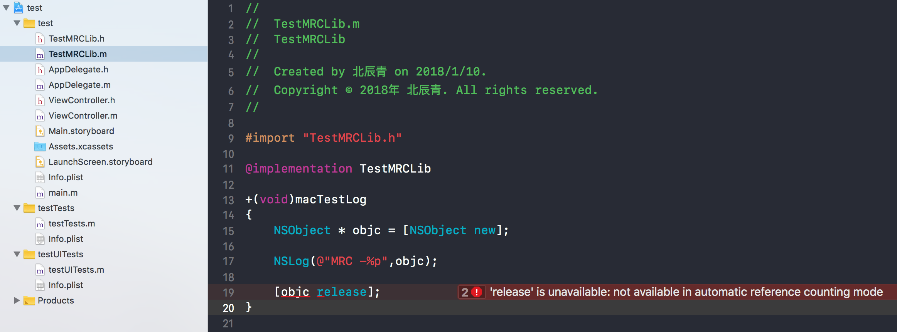
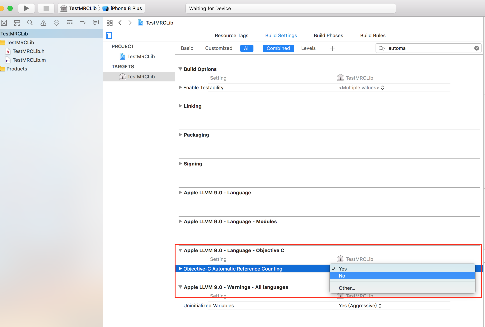
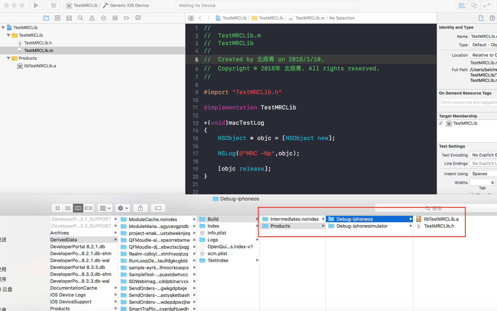

# 8.7 私有库二进制化-MRC

## MRC 在ARC下使用

* ARC -- Automatic Reference Counting：自动引用计数

* MRC -- Manual Reference Counting：人工引用计数

iOS5.0以后就开始可以使用ARC来代替之前的MRC。使用ARC会减少很多代码和忘了释放对象的苦恼。但是事情都有两面性。使用了ARC之后如果你想复用以前写过的使用MRC的类， 就会出报错。这时候怎么办？方法比较简单， 只需要做下面的一个步骤就可以解决：

* 在targets的build phases选项下Compile Sources下选择要不使用arc编译的文件，双击它，输入-fno-objc-arc即可

* MRC工程中也可以使用ARC的类。方法如下：
在targets的build phases选项下Compile Sources下选择要使用arc编译的文件，双击它，输入-fobjc-arc即可

## MRC 代码二进制包化 

工程混编容易导致代码管理容易出现疏忽，故此将MRC代码单独抽离为二进制

* MRC代码单独创建二进制库工程

* 将二进制文件引入目标工程即可使用

