# 8.8 私有库二进制化-动态库静态库相互引用


苹果爸爸的 iOS 升级到了 8，iOS 出现了``APP Extension``，swift编程语言也诞生了，由于 iOS 主 APP 需要和 ``Extension`` 共享代码，Swift 语言的机制也只能有动态库，于是苹果爸爸尴尬了，不过这难不倒我们的苹果爸爸，毕竟我是爸爸，规则是我来定，我想怎样就怎样，于是提出了一个概念``Embedded Framework``，这种动态库允许``APP ``和`` APP Extension``共享代码，但是这份动态库的生命被限定在一个 APP 进程内。简单点可以理解为 被阉割的动态库。


### iOS 项目中使用 ``Embedded Framework``


如果你把某个自己开发的动态库(系统的不算，毕竟苹果是爸爸)放在了``Linked Frameworks and Libraries``里面，程序一启动就会报``Reason: Image Not Found``，你只能把它放在``Embeded Binaries``里面才能正常使用


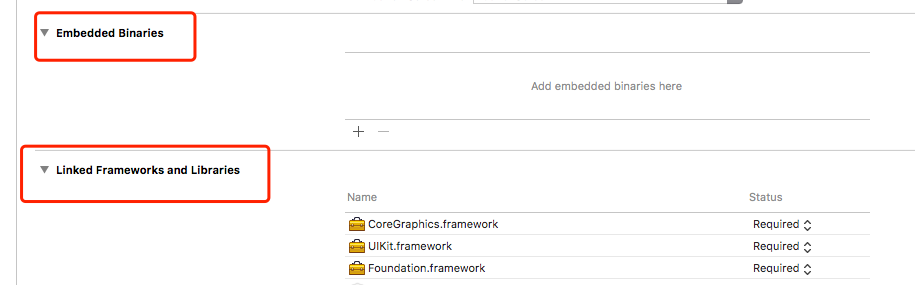


### 静态库和动态库如何构建加载


* 静态库: 一堆目标文件(.o/.obj)的打包体(并非二进制文件)

* 动态库: 一个没有 main 函数的可执行文件


##### C 语言的基本功，编译和链接

编译: 将我们的源代码文件编译为目标文件
链接: 将我们的各种目标文件加上一些第三方库，和系统库链接为可执行文件。
由于某个目标文件的符号(可以理解为变量，函数等)可能来自其他目标文件，其实链接这一步最主要的操作就是 决议符号的地址。

* 若符号来⾃静态库(本质就是.o 的集合包)或 .o，将其纳⼊链接产物，并确定符号地址

* 若符号来⾃动态库，打个标记，等启动的时候再说---交给 dyld 去加载和链接符号


静态库和动态库链接加装载就有了不同的情况

1. Load 装载：将库⽂件载⼊内存

	* Static Loading：启动时
	* Dynamic Loading：启动后（使⽤时）

2. Link 链接：决议符号地址

	* Static Linking：构建（链接）时
	
	* Dynamic Linking：运⾏时（启动时或使⽤时）


排列组合之后 

*  ``Static Loading + Static Linking ``  纯静态库相关 

*  ``Static Loading + Dynamic Linking `` 静态加载(启动时)，动态链接 ，链接时，动态库参与链接，但是这时候只是给符号打了标记告诉我这个符号来自与动态库，程序启动时，iOS 或者 Mac OS 操作系统的 dyld 自动 load + link . 既然全部都是自动的。那么符号的调用方完全不知道你到底是源码还是静态库，动态库 。

*  ``Dynamic Loading + Dynamic Linking `` 收到调用 dlopen + performSelector 通常 iOS 的 APP 不适用这里不讨论

* ``~~Dynamic Loading + Static Linking~~``  


静态库和动态库依赖组合

* ``libA.a dependency libB.a``   静态库互相依赖，这种情况非常常见，制作静态库的时候只需要有被依赖的静态库头文件在就能编译出来。但是这就意味者你要收到告诉使用者你的依赖关系 幸运的是 CocoaPod早期就是这样做的

* ``UIKit.dylib dependency Foundation.dylib``  动态库依赖动态库，两个动态库是相互隔离的具有隔离性，但是制作的静态库的时候需要被依赖动态库参与链接，但是具体的符号决议交给dyld来做。  

* ``libA.a dependency Foundation.dylib``   静态库依赖动态库，也很常见，静态库制作的时候也需要动态库参与链接，但是符号的决议交给 dyld 来做。

* ``MyXX.dylib dependency libA.a``   动态库依赖静态库，这种情况就有点特殊了。首先我们设想动态库编译的时候需要静态库参与编译，但是静态库交由 dyld 来做符号决议，but 这和我们前面说的就矛盾了啊。静态库本质是一堆.o 的打包体，首先并不是二进制可执行文件，再者你无法保证主程序把静态库参与链接共同生成二进制可执行文件。这就尴尬了。怎么办？目前的编译器的解决办法是，首先我无法保证主程序是否包含静态库，再者静态库也无法被``dyld``加载，那么我直接把你静态库的.o 偷过来，共同组成一个新的二进制。也被称做``吸附性``,那么我有多份动态库都依赖同样的静态库，这就尴尬了，每个动态库为了保证自己的正确性会把静态库吸附进来。然后两个库包含了同样的静态库，于是问题就出现了


### 总结

可执⾏⽂件（主程序或者动态库）在构建的链接阶段

* 遇到静态库，吸附进来
* 遇到动态库，打标记，彼此保持独⽴


## 二进制化生产工程PodFile文件中加上 ``use_framework!`` 出现的问题

```
The 'Pods-XXX_Example' target has transitive dependencies that include static binaries: (/Users/Desktop/Static_Dynamic/Componment/Example/Pods/libWeChatSDK/libWeChatSDK.a)

```

*  ``pod install`` 出错的原因了。就是用了use_framework那么我们的所有 Pod 都会以动态库(Embeded Framework)的形式去构建，于是那些非开源的库(如 百度地图，微信分享)如果被多个 Pod 依赖(组件化开发中太常见了)于是被吸附到动态库里面，所以 CocoaPod 直接就不让我们 install 成功。因为你现在的依赖管理就是错误的。


* 苹果爸爸在 iOS9 以下对__text 段 60M 的限制使用了动态库方案，某些 swift 库必须要用到(历史遗留原因)动态库；动态库和动态库是``隔离性``，动态库依赖静态库具有``吸附性``，那么我们可以自定义一个动态库把百度地图这种静态库吸附进来。对外整体呈现的是动态库特性。其他的组件依赖我们自定义的动态库，由于隔离性的存在，不会出现问题


## 生产发布使用动态库导致的一系列问题


### Swift 或者和 OC 混编来写业务带来的问题

组件化初期的时候，我们能做到的一般是基础库抽离，业务组件分离这些。但是一般来说我们这时候的壳工程，接入这些分离的组件的时候都是使用源码接入，这时候问题暂时显现不出来。


当我们的组件化的脚步越走越远的时候，我们出于多方面的考虑可能有以下需求

* 开发时重复编译是痛点。我们可能更希望提供的是二进制版本，节省下大量的编译耗时；

* 我们可能要做权限管理。有时候一个公司业务和人员规模都非常庞大。我们基础库设计到跨业务，跨 APP 使用。我们希望不同团队有不同基础组件的读写权限。那么我们更可能偏向提供二进制库加文档的形式。


#### Swift 中库依赖问题

由于 Swift 不和 OC 一样，所有的 OC 方法都是通过 Runtime 动态调度的。Swift 对于方法是存在静态调度和动态调度 2 种的。所以 Swift 的库依赖极易引起二进制兼容性问题。更多关于 Swift 库二进制接口(ABI)兼容性问题，请参考[Swift库二进制接口(ABI)兼容性研究](https://www.jianshu.com/p/5860f5542f21#)


#### Objective-C 静态库依赖问题

在 iOS 中出现上述的依赖问题，貌似也没有见到要重新编译 A 的情景。主要是 Objc2.0 引入了 non-fragile 特性，同时 OC 是严重依赖于 Runtime 的，只要接口兼容，就算你修改了 B 中的数据结构，一般也是不需要重新编译 A 的

#### C + +/C 静态库依赖问题

在 C 或者 C + + 开发中，如果一个静态库依赖另外一个静态库(A 依赖 B)。那么被依赖库 B 升级的时候 A 用重新编译吗？ 不一定，如果是一些方法的新增，维护，不一定会让 A 重复编译；但是如果修改了 B 里面的数据结构，A 里面又用到了这些数据结构，那么很大可能性我们就要重新编译 A 了。


### 动态库过多导致的问题 

动态库多了会给用户带来麻烦(APP 启动耗时)。用了混编的项目我们在Podfile里面势必要写use_framework!, 上篇文章中我们也说到用了这个指令。CocoaPods会帮我们把所有的库全部编译为动态库。这些动态库是在 APP 启动时做去加载的。我们在组件化的时候，自己的业务组件马上接近上百个。可以预想到以后随着组件化的越来越深入，这些库会越来越多。这个时间可能会达到 1s 的量级。对于用户 这是不可接受的


## CocoaPods究竟是如何构建工程以及达成库依赖


### CocoaPods 组件样板工程 

*  组件样板工程  默认使用 ``   use_frameworks!  ``

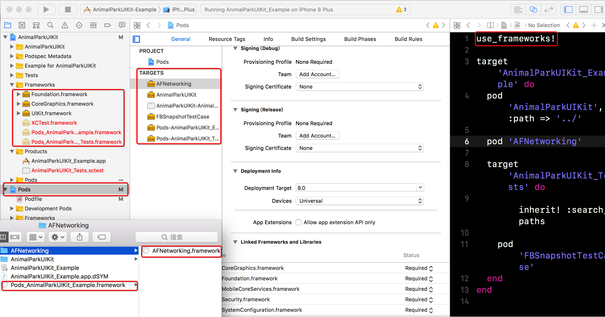

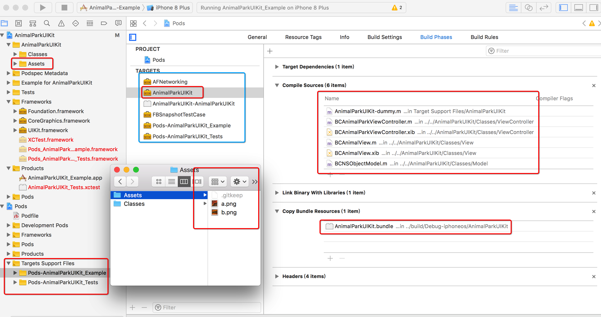

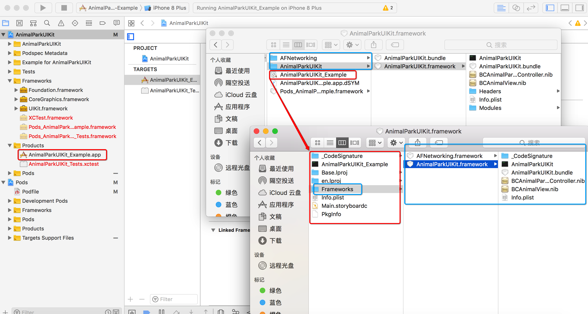

* 使用 ``   use_frameworks!  `` 组件会被以动态库载入工程 

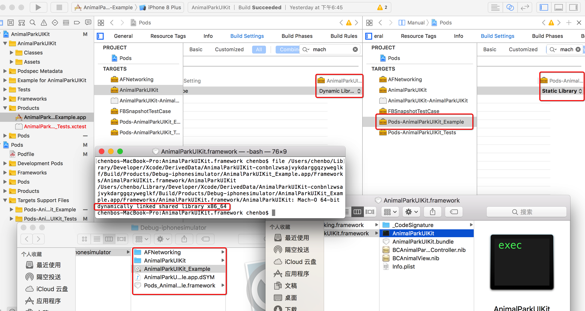


### 生产发布主工程结构 

* 主工程AnimalParkProject与组件通过Pod_AnimalParkProject完成依赖

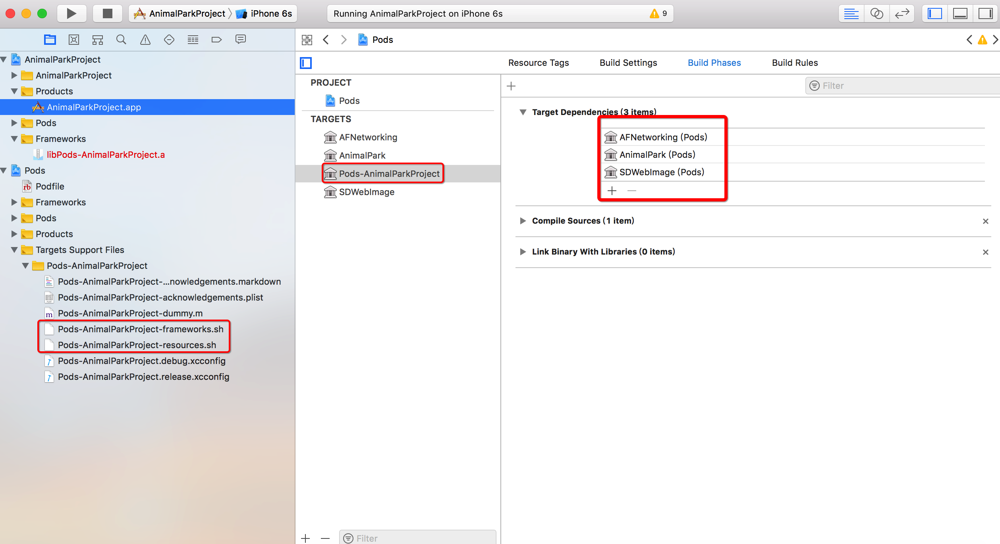

* Pod_AnimalParkProject内构建组件与主工程依赖脚本代码

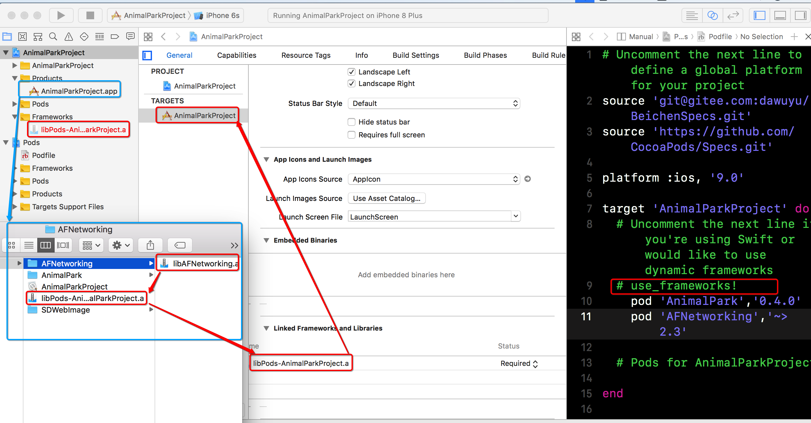

* 在``# use_frameworks!`` 主工程中组件将会以静态库.a 形势载入工程

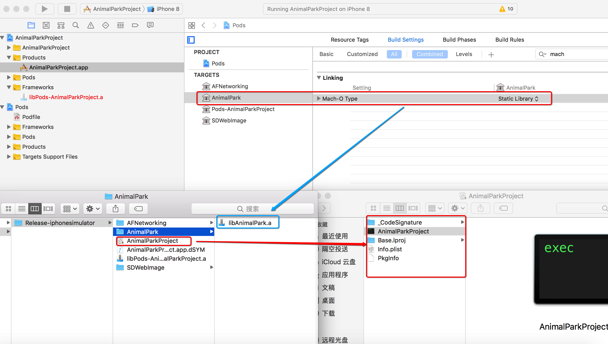


### 组建库以动态库方式构建 主工程以静态库方式建立依赖导致的问题


* 由于组件工程构建时使用 `` use_frameworks! `` 与主工程不使用 `` use_frameworks! ``  引起 组件以.a 文件 参与编译，引起xib,nib资源报错


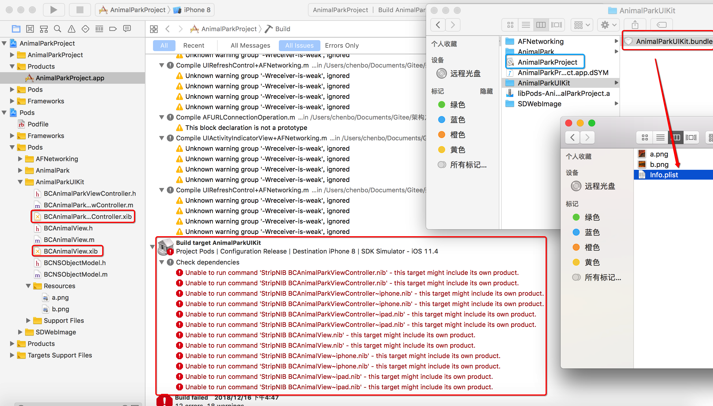


### 解决方案 


#####  方案一 就是将xib文件等放入Bundle内，

*  组件工程使用或者不使用 `` use_frameworks! ``  组件工程引用资源按照.a静态库方式引用资源


####  方案 二  主工程中使用  `` use_frameworks! ``   但修改 pod 架构设置  

* 将pod 所拥有 项目架构支持设置修改为 `` static Library ``  但每次pod install 后 都需要重新设置，后期尝试如何使用脚本自动化解决

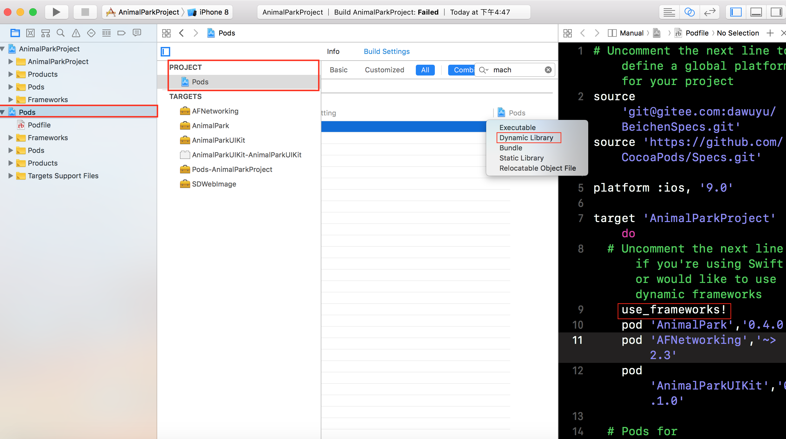


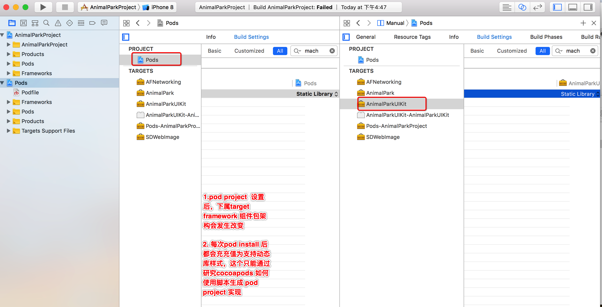


* 查看 编译结果后发现 组件库以静态库方式链接可执行文件  


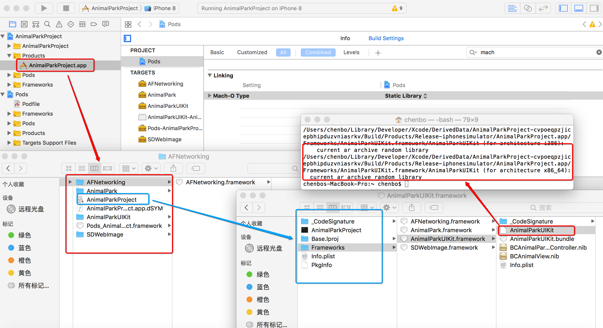


### 方案 三 主工程中使用  `` use_frameworks! `` 可以修改 第三方库podspec说明文件

> Cocoapods 在1.4.0之后提供了静态框架的特性.过去的ues_framework!只能发布动态库,现在可以发布静态的框架.这一特性解决了过去动态框架不能依赖静态库的弊端

* 在podspec 文件中加入

```
s.static_framework = true

```
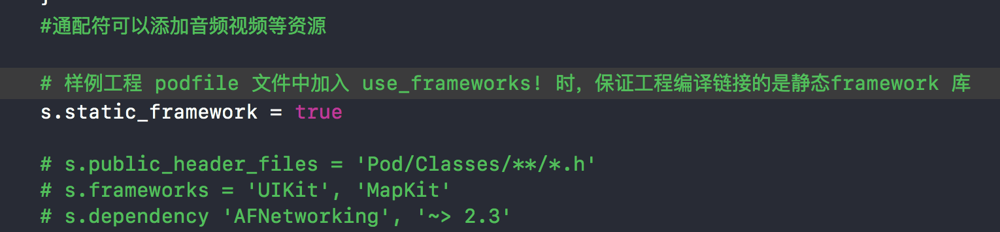

* 执行结果

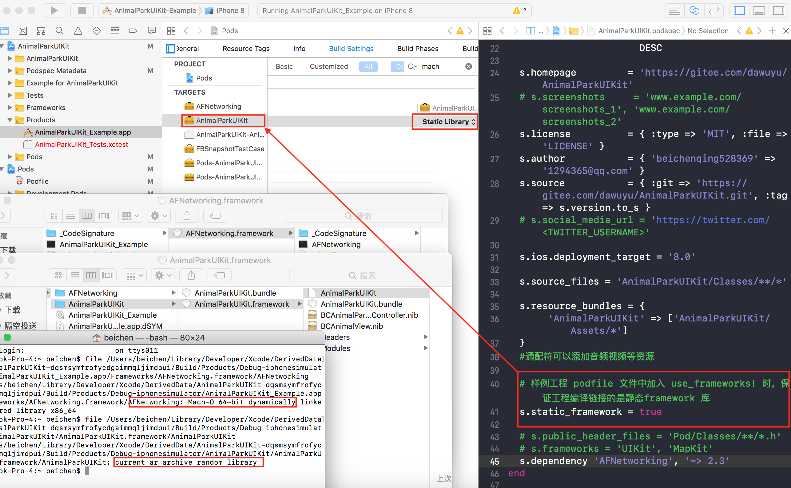


 


[动态库实战 -- 私有化](https://www.valiantcat.cn/index.php/2017/04/24/45.html)