# 8.9 framework动态库库生产流程


## 基础准备

* 创建一个动态库testSDK   测试工具类

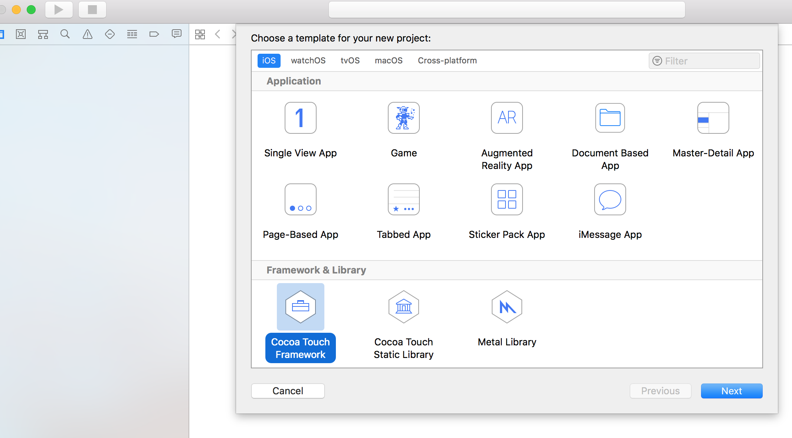

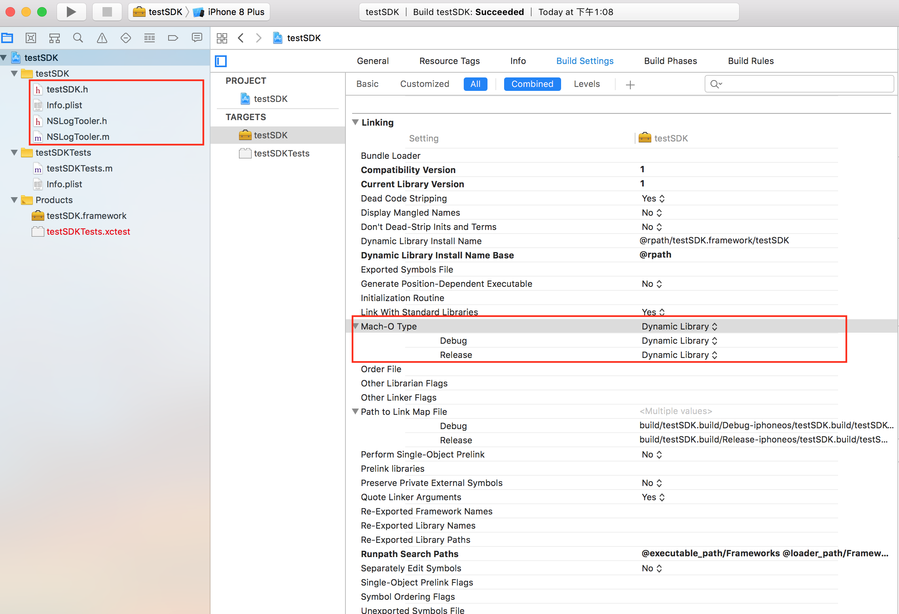


* 在``testSDK.h``中 ``#import "NSLogTooler.h"``

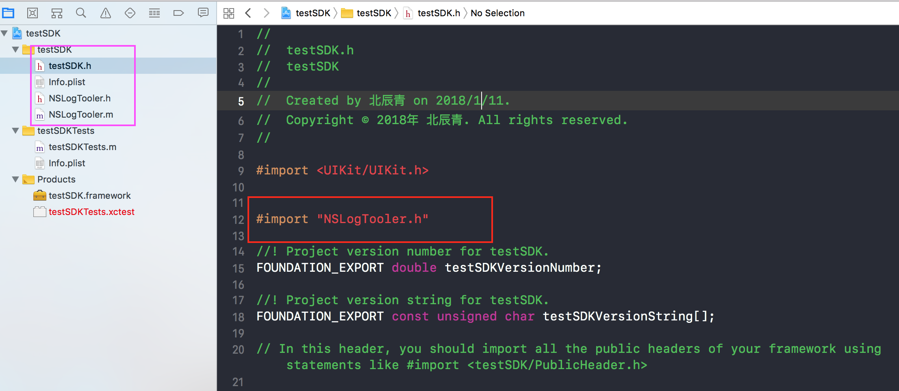


* 点击工程 -> 在``targets``中选中``MangoSDK`` -> ``Build Phases`` -> ``Headers``，如下图所示，可以看到在动态库中创建的文件会自动添加到``Build Phases``中的project列表中，``testSDK.h``文件是处于Public列表中，所以外部只能看到``testSDK.h``这个头文件，由于我们动态库外部使用者需要调用``NSLogTooler.h``中的方法，所以也需要将``NSLogTooler.h``拖拽到Public列表中.

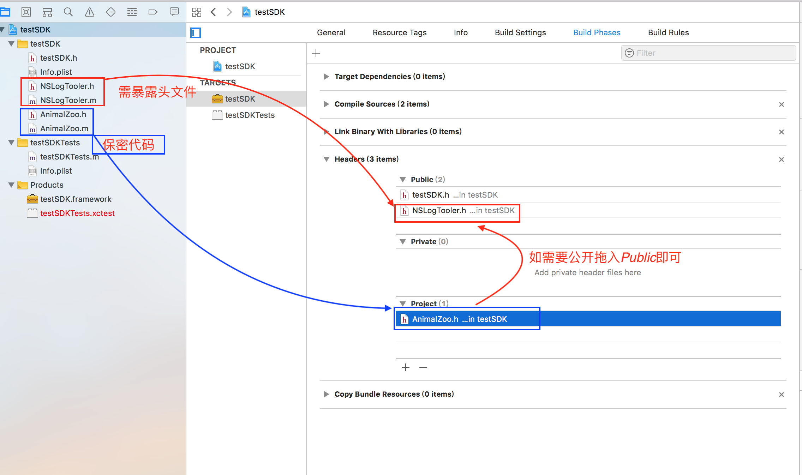


##  编译动态库

* 选择动态库对应的Scheme，选择编译设备为对应的真机，如果没有连接真机，也可以，只要选择``Generic iOS Device``选项也是可以编译出对应真机的动态库


* 编译动态库(command + shift + B)后，在Xcode工程中的Products(这个目录不是工程源文件目录，而是编译后生成对应的沙盒目录)找到].framework文件

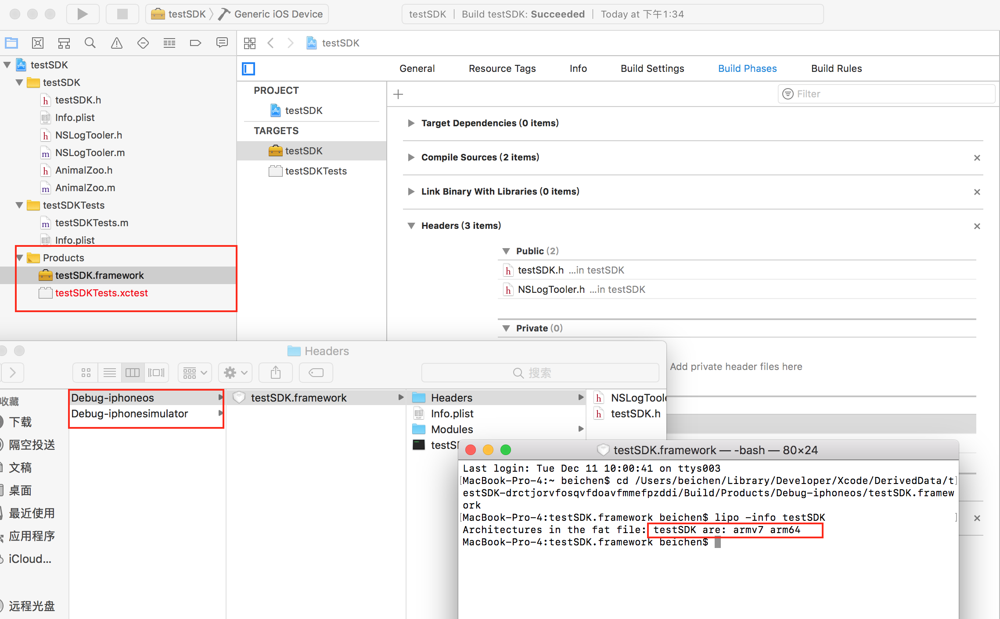


* 利用lipo -info 查看动态库所支持的CPU指令集

	* 打开终端
	* cd 进入testSDK.framework，这里需要注意进入的是testSDK.framework，而不是testSDK.framework所在目录
	* 在终端输入$lipo -info testSDK


## 指令集的介绍

### 指令集种类

* armv7｜armv7s｜arm64都是ARM处理器的指令集
* i386｜x86_64 是iOS模拟器的指令集

### 指令集对应的机型

```
arm64：iPhone6s | iphone6s plus｜iPhone6｜ iPhone6 plus｜iPhone5S | iPad Air｜ iPad mini2(iPad mini with Retina Display)
armv7s：iPhone5｜iPhone5C｜iPad4(iPad with Retina Display)
armv7：iPhone4｜iPhone4S｜iPad｜iPad2｜iPad3(The New iPad)｜iPad mini｜iPod Touch 3G｜iPod Touch4

i386: iPhone5 | iPhone 4s | iPhone 4及前代产品的模拟器
x86_64: iPhone5s | iPhone 6 | ... | iPhone8的模拟器

```


### 指令集兼容性说明

* 理论上指令集是向下兼容的,比如连接设备为arm64，那么是有可能编译出的动态库所支持的指令集为armv7s或者是armv7

* 但是向下兼容并不是说一个armv7s的动态库可以用在arm64架构的设备上，如果连接的设备是arm64的，而导入的动态库是没有支持arm64，那么在编译阶段即会报错


## Xcode指令集的编译选项说明

* 打开 Target -> Build Setting -> Architectures

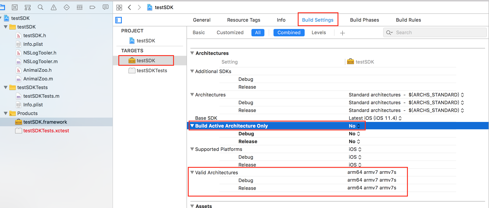

### 介绍一下三个编译选项

* ``Architectures``:指明选定Target要求被编译生成的二进制包所支持的指令集

* ``Build Active Architecture Only``: 指明是否只编译当前连接设备所支持的指令集，如果是，那么只编译出连接设备所对应的指令集，如果否，则编译出所有其它有效的指令集(由``Architectures``和``Valid Architectures``决定)
* ``Valid Architectures``:指明可能支持的指令集并非Architectures列表中指明的指令集都会被支持


### 编译产生的动态库所支持的指令集将由上面三个编译选项所影响，首先一个动态库要成功编译，则需要这三个编译选项的交集不为空

```
示例1：
  Architectures 为armv7、arm64
  Valid Architectures 为armv7、armv7s、arm64
  Build Active Architecture Only 为 debug:YES release:NO
  链接设备:iPhone 6s (arm64架构的设备)
  编译(command + shift + B,保证Build Active Architecture Only 为 debug:YES 生效)
  结果：编译成功，生成的动态库支持的指令集为arm64

示例2：
  Architectures 为armv7、arm64
  Valid Architectures 为 armv7s
  Build Active Architecture Only 为 debug:YES release:NO
  链接设备:iPhone 6s (arm64架构的设备)
  编译(command + shift + B,保证Build Active Architecture Only 为 debug:YES 生效)
  结果：编译失败，因为当前是debug模式，在该模式下Build Active Architecture Only  为YES，表示只编译支持该指令集的动态库，
      但是由于Architectures和Build Active Architecture Only的交集中并不存在arm64，故三者的交集为空，故编译失败，无法生成动态库。

示例3：
  Architectures 为armv7、arm64
  Valid Architectures 为armv7、armv7s、arm64
  Build Active Architecture Only 为 debug:NO release:NO
  链接设备:iPhone 6s (arm64架构的设备)
  编译(command + shift + B,保证Build Active Architecture Only 为 debug:YES 生效)
  结果：编译成功，因为当前是debug模式，在该模式下Build Active Architecture Only  为NO，
    表示可以编译的结果可能为当前连接的设备所支持的指令集以及其向下兼容的指令集(armv64、armv7s、armv7)，其和另外两个编译选项的交集为armv7，故所生成的动态库支持的指令集为armv7


```

真机6s编译动态库中之所以会生成支持arm64的动态库

```
1.Build Active Architecture Only 为 debug:YES release:NO
2.我们使用的是编译，所以生效的选项为debug:YES,表示只生成当前机型对应的指令集(iPhone 6sp为 arm64)
3. Architectures和Valid Architectures的交集为armv7、arm64，故三个选项的最终交集只有arm64，所以生成的动态库只支持arm64指令集

```


## 制作支持iPhone 4及以后机型的动态库


### 支持iPhone 4 及以后机型的动态库的意思是:生成的动态库支持的指令集为armv7、armv7s、arm64，所以Architectures的三个指令可以设置为

* ``Build Active Architecture Only`` 统一为NO(如果不修改，则不能使用编译去生成动态库，而是需要去修改scheme的run模式为release，并且command + R运行动态库，为了简便，这里统一设置为NO)

* Architectures和Valid Architectures都设置为armv7、armv7s、arm64


### 设置后的Architecture 

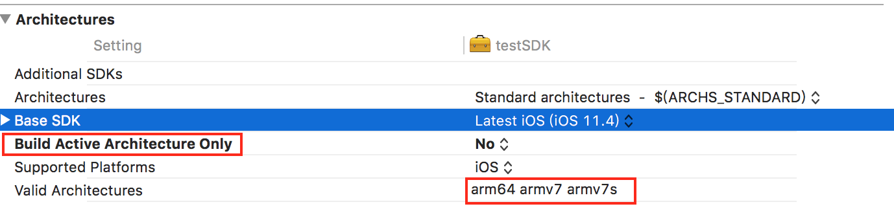

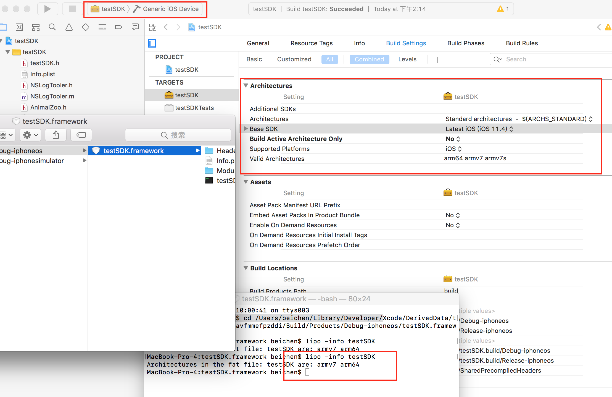


* 修改工程支持最低系统版本

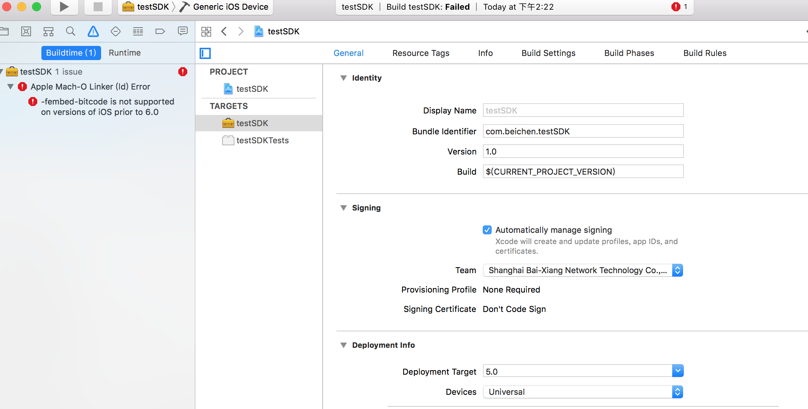

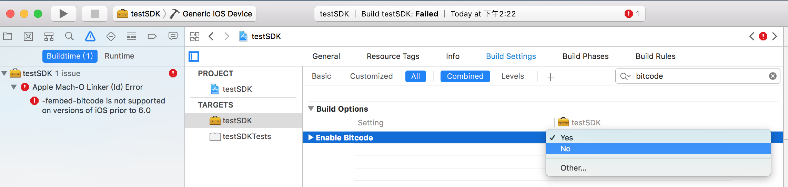


* 编辑 `` Architecture  ``

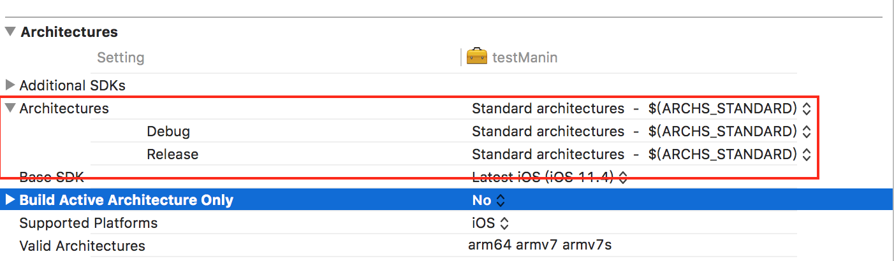

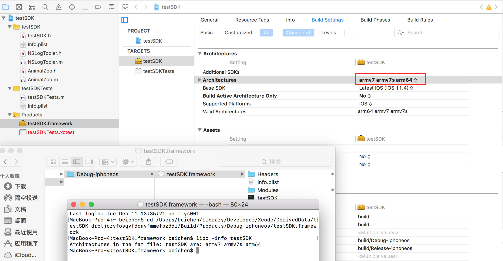


##  合并模拟器和真机动态库-- Aggregate

* 新建一个target脚本

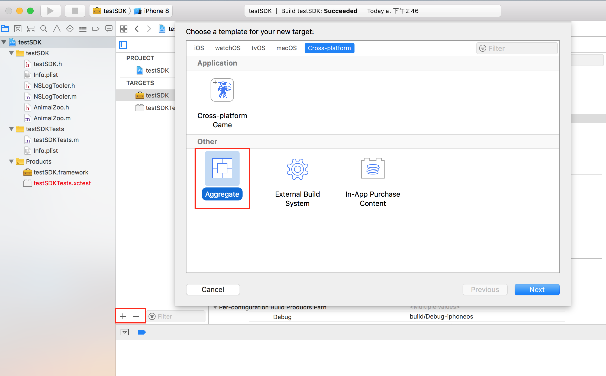


* 粘贴以下脚本内容到指定位置

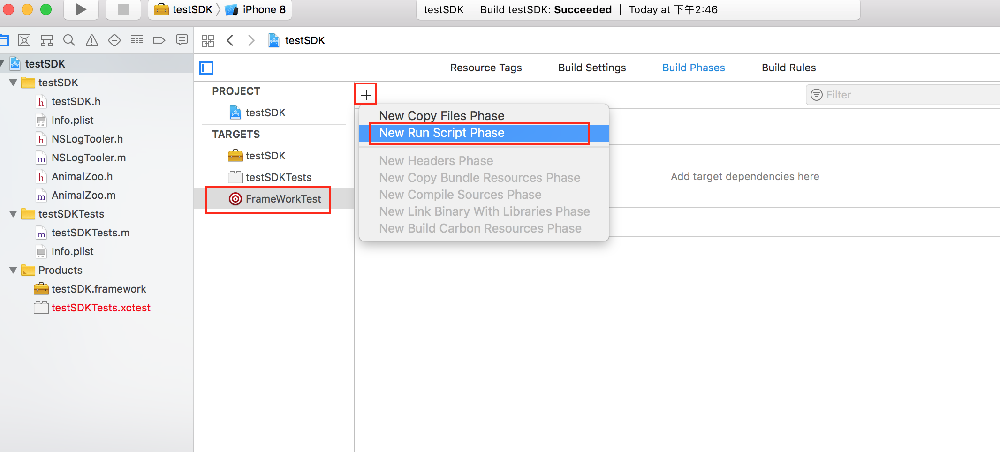


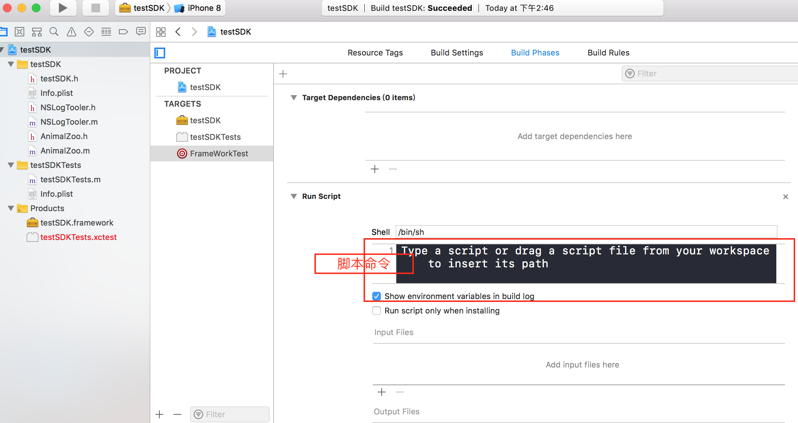


脚本 一

```
if [ "${ACTION}" = "build" ]
then
INSTALL_DIR=${SRCROOT}/Products/${PROJECT_NAME}.framework

DEVICE_DIR=${BUILD_ROOT}/${CONFIGURATION}-iphoneos/${PROJECT_NAME}.framework

SIMULATOR_DIR=${BUILD_ROOT}/${CONFIGURATION}-iphonesimulator/${PROJECT_NAME}.framework


if [ -d "${INSTALL_DIR}" ]
then
rm -rf "${INSTALL_DIR}"
fi

mkdir -p "${INSTALL_DIR}"

cp -R "${DEVICE_DIR}/" "${INSTALL_DIR}/"
#ditto "${DEVICE_DIR}/Headers" "${INSTALL_DIR}/Headers"

# 使用lipo命令将其合并成一个通用framework  
# 最后将生成的通用framework放置在工程根目录下新建的Products目录下  
lipo -create "${DEVICE_DIR}/${PROJECT_NAME}" "${SIMULATOR_DIR}/${PROJECT_NAME}" -output "${INSTALL_DIR}/${PROJECT_NAME}"

#open "${DEVICE_DIR}"
#open "${SRCROOT}/Products"
fi


```
脚本 二

```
# Sets the target folders and the final framework product.
FMK_NAME=${PROJECT_NAME}

# Install dir will be the final output to the framework.
# The following line create it in the root folder of the current project.
INSTALL_DIR=${SRCROOT}/Products/${FMK_NAME}.framework

# Working dir will be deleted after the framework creation.
WRK_DIR=build
DEVICE_DIR=${WRK_DIR}/Release-iphoneos/${FMK_NAME}.framework
SIMULATOR_DIR=${WRK_DIR}/Release-iphonesimulator/${FMK_NAME}.framework

# -configuration ${CONFIGURATION} 
# Clean and Building both architectures.
xcodebuild -configuration "Release" -target "${FMK_NAME}" -sdk iphoneos clean build
xcodebuild -configuration "Release" -target "${FMK_NAME}" -sdk iphonesimulator clean build

# Cleaning the oldest.
if [ -d "${INSTALL_DIR}" ]
then
rm -rf "${INSTALL_DIR}"
fi

mkdir -p "${INSTALL_DIR}"

cp -R "${DEVICE_DIR}/" "${INSTALL_DIR}/"

# Uses the Lipo Tool to merge both binary files (i386 + armv6/armv7) into one Universal final product.
lipo -create "${DEVICE_DIR}/${FMK_NAME}" "${SIMULATOR_DIR}/${FMK_NAME}" -output "${INSTALL_DIR}/${FMK_NAME}"

rm -r "${WRK_DIR}"

```


* 编译新target

注意： 需要在模拟器与真机都运行出二进制库

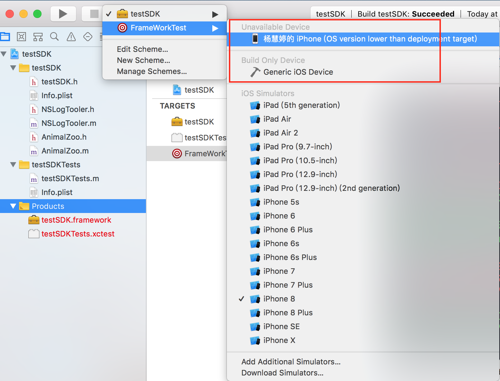


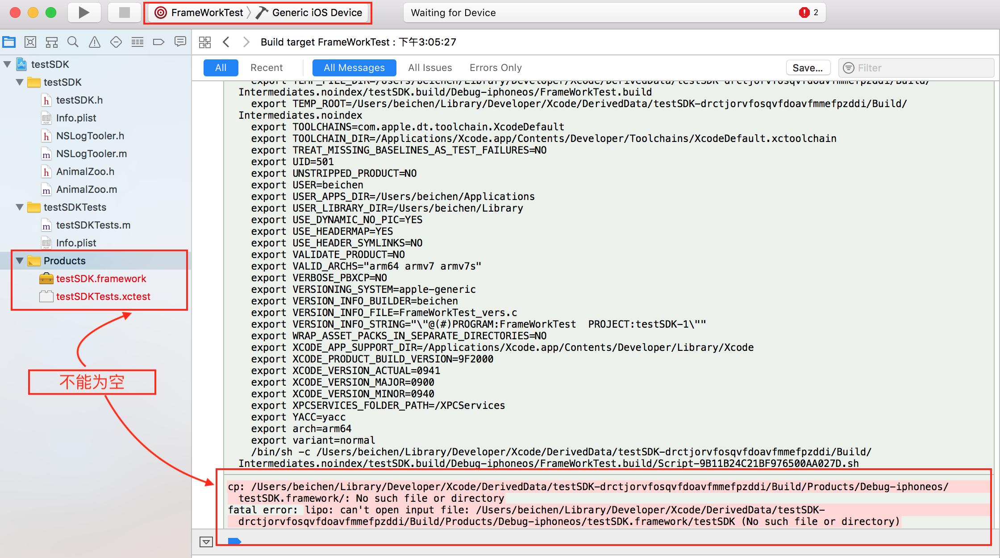


* 编译完成后生成的framework位于工程源代码根目录下的Products文件夹下面，通过lipo -info可以看到动态库已经支持i386、x86_64、armv7、armv7s、arm64，如下图所示

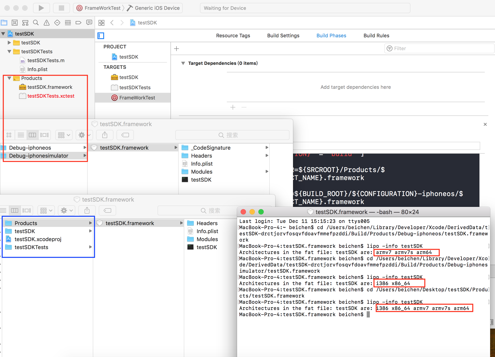


## 使用动态库

在新工程的target中的General -> Embedded Binaries中添加testSDK.framework

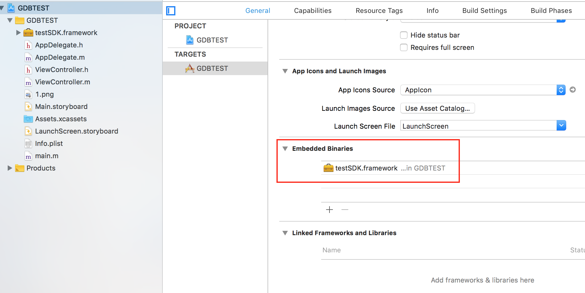


* 第三方库所支持的CPU指令集不全
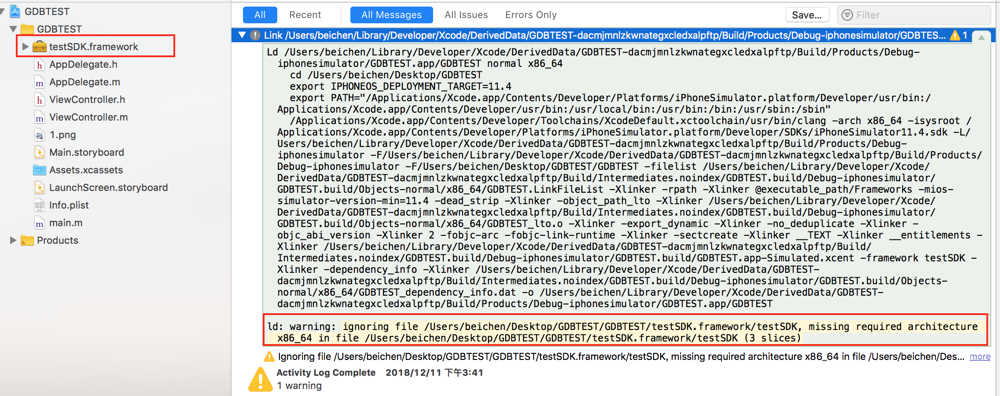

* 运行过程中出现 ``image not found``异常或者控制台没有异常输出,动态库不能使用静态库引用

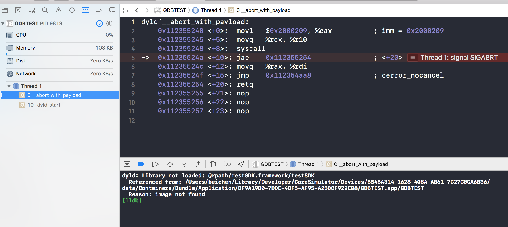


