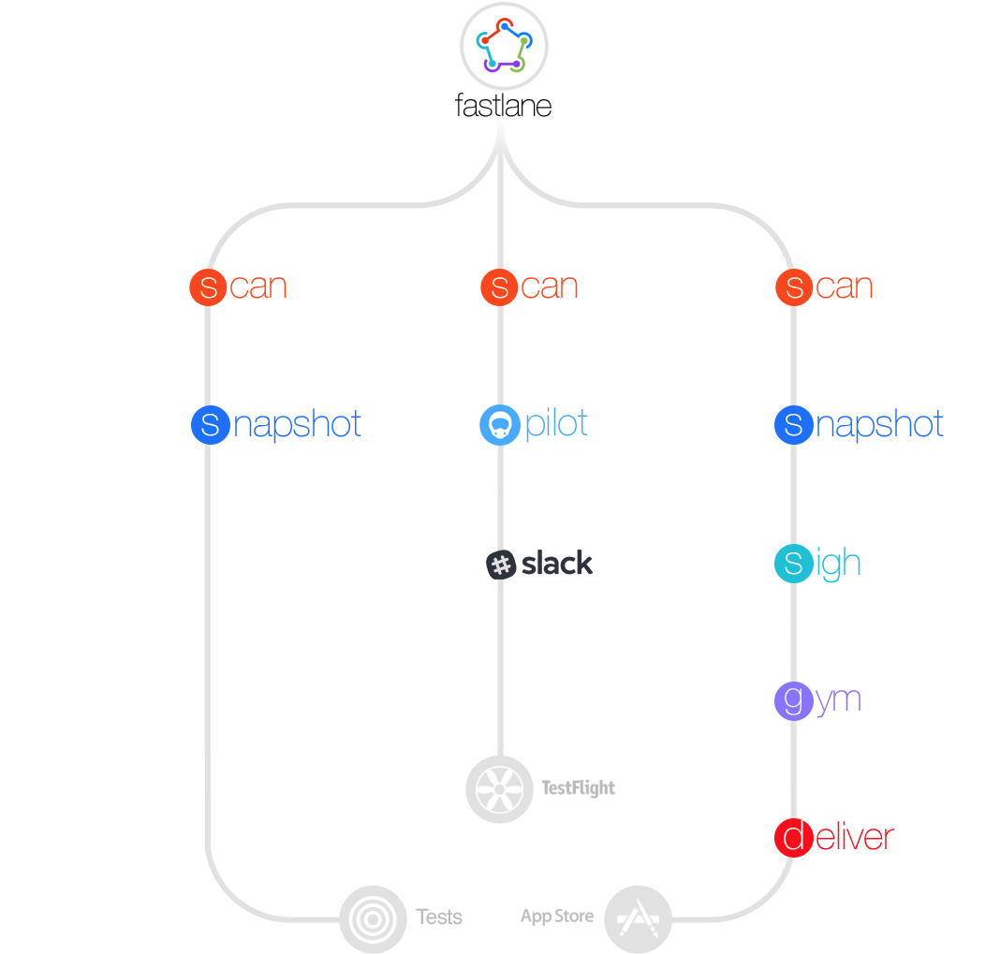
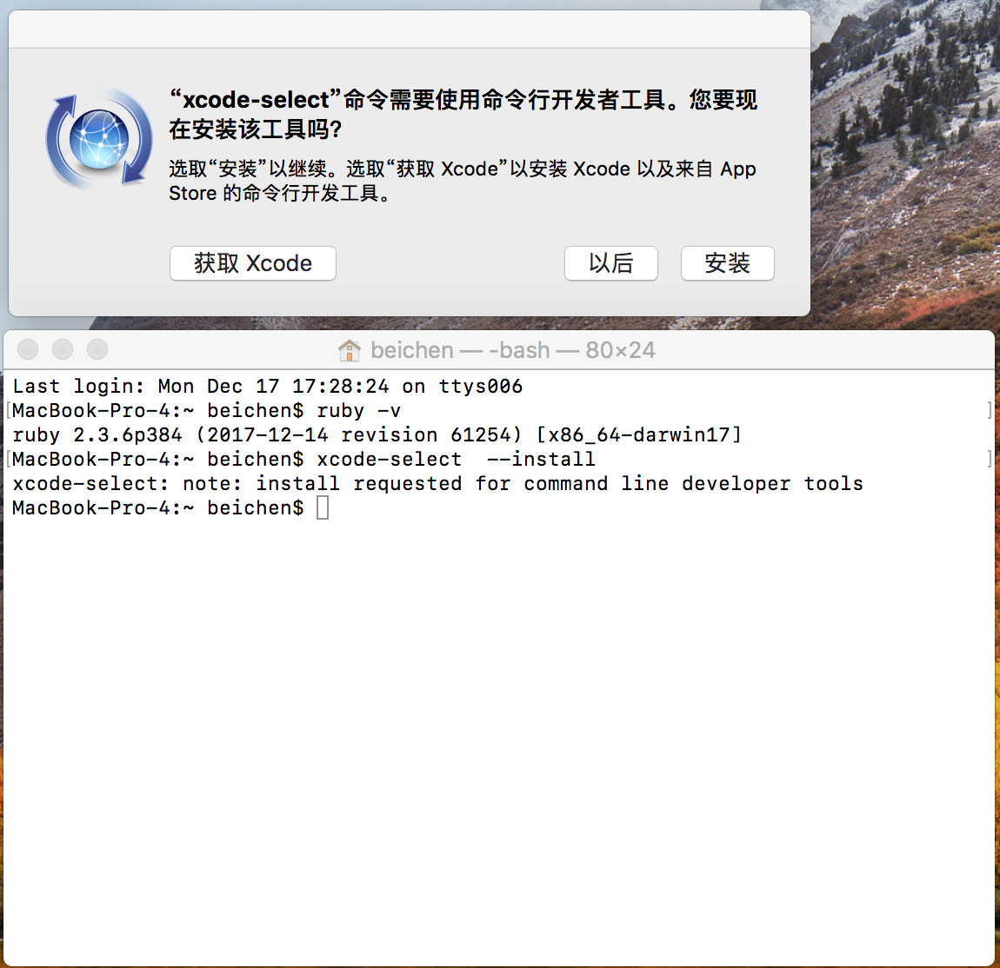
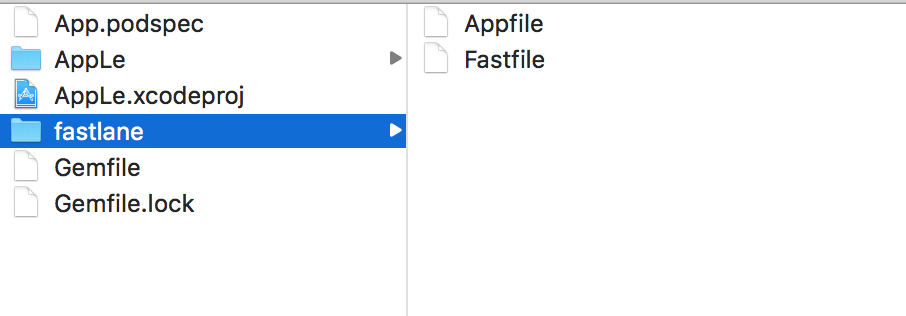
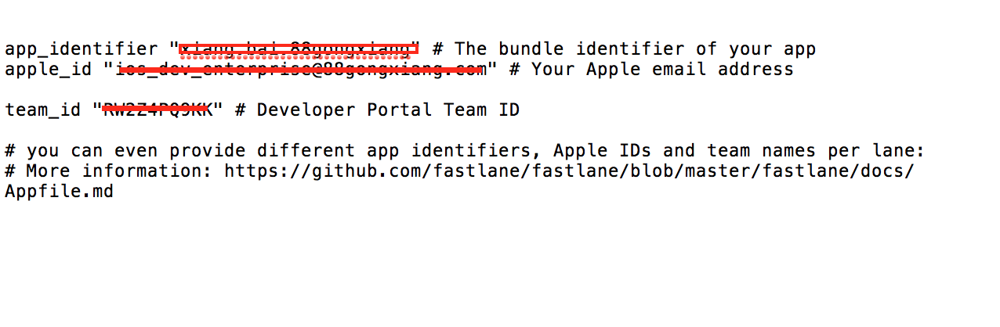
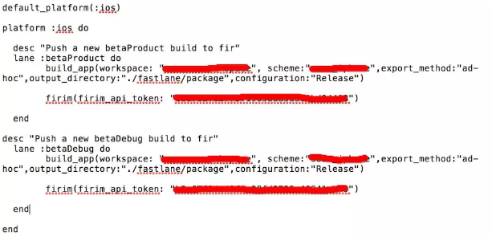

# 9.2 自动化-工具准备Fastline


## Fastline 安装

[fastlane官网](https://fastlane.tools)


[Github](https://github.com/fastlane/fastlane)

[文档](https://docs.fastlane.tools/)




#### 安装前的准备工作

* 确认是否安装了ruby，终端查看下ruby版本

```
ruby -v

```


* 确认是否安装了Xcode命令行工具

```

xcode-select  --install

```



安装成功标志

```
MacBook-Pro-4:~ beichen$ xcode-select  --install
xcode-select: error: command line tools are already installed, use "Software Update" to install updates

```

#### 安装fastlane步骤

* 安装fastlane

```
sudo gem install fastlane

```

```
如果用的是mac自带的ruby，需要 sudo权限
使用: sudo gem install fastlane

如果报错：ERROR: While executing gem ... (Errno::EPERM) Operation not permitted - /usr/bin/commander 
使用: sudo gem install -n /usr/local/bin fastlane
```


安装成功

```
Done installing documentation for slack-notifier, rouge, xcpretty, terminal-notifier, unicode-display_width, terminal-table, plist, public_suffix, addressable, multipart-post, word_wrap, tty-screen, tty-cursor, tty-spinner, babosa, colored, highline, commander-fastlane, excon, unf_ext, unf, domain_name, http-cookie, faraday, faraday-cookie_jar, fastimage, mini_magick, multi_json, multi_xml, rubyzip, security, xcpretty-travis-formatter, dotenv, faraday_middleware, naturally, simctl, uber, declarative, declarative-option, representable, retriable, mime-types-data, mime-types, jwt, signet, memoist, os, googleauth, httpclient, google-api-client, google-cloud-env, google-cloud-core, digest-crc, google-cloud-storage, emoji_regex, fastlane after 270 seconds
56 gems installed

```


* 切换到工程目录初始化

```
fastlane init

```

* 初始化的过程中会出现下面的选项

```
[10:21:38]: What would you like to use fastlane for?
1. 📸  Automate screenshots : 自动截屏。这个功能能帮我们自动截取APP中的截图，并添加手机边框（如果需要的话）
2. 👩‍✈️  Automate beta distribution to TestFlight :自动发布beta版本用于TestFlight
3. 🚀  Automate App Store distribution : 自动发布到AppStore
4. 🛠  Manual setup - manually setup your project to automate your tasks : 手动设置

```

* 选的是第四个 紧接着一直点击enter键，知道安装成功

```
[10:28:54]: ------------------------------------------------------------
[10:28:54]: --- Setting up fastlane so you can manually configure it ---
[10:28:54]: ------------------------------------------------------------
[10:28:54]: Installing dependencies for you...
[10:28:54]: $ bundle update


[10:37:14]: --------------------------------------------------------
[10:37:14]: --- ✅  Successfully generated fastlane configuration ---
[10:37:14]: --------------------------------------------------------
[10:37:14]: Generated Fastfile at path `./fastlane/Fastfile`
[10:37:14]: Generated Appfile at path `./fastlane/Appfile`
[10:37:14]: Gemfile and Gemfile.lock at path `Gemfile`
[10:37:14]: Please check the newly generated configuration files into git along with your project
[10:37:14]: This way everyone in your team can benefit from your fastlane setup
[10:37:14]: Continue by pressing Enter ⏎
[10:37:14]: fastlane will collect the number of errors for each action to detect integration issues
[10:37:14]: No sensitive/private information will be uploaded, more information: https://docs.fastlane.tools/#metrics
[10:37:14]: ----------------------
[10:37:14]: --- fastlane lanes ---
[10:37:14]: ----------------------
[10:37:14]: fastlane uses a `Fastfile` to store the automation configuration
[10:37:14]: Within that, you'll see different lanes.
[10:37:14]: Each is there to automate a different task, like screenshots, code signing, or pushing new releases
[10:37:14]: Continue by pressing Enter ⏎
[10:37:14]: --------------------------------------
[10:37:14]: --- How to customize your Fastfile ---
[10:37:14]: --------------------------------------
[10:37:14]: Use a text editor of your choice to open the newly created Fastfile and take a look
[10:37:14]: You can now edit the available lanes and actions to customize the setup to fit your needs
[10:37:14]: To get a list of all the available actions, open https://docs.fastlane.tools/actions
[10:37:14]: Continue by pressing Enter ⏎
[10:37:14]: ------------------------------
[10:37:14]: --- Where to go from here? ---
[10:37:14]: ------------------------------
[10:37:14]: 📸  Learn more about how to automatically generate localized App Store screenshots:
[10:37:14]: 		https://docs.fastlane.tools/getting-started/ios/screenshots/
[10:37:14]: 👩‍✈️  Learn more about distribution to beta testing services:
[10:37:14]: 		https://docs.fastlane.tools/getting-started/ios/beta-deployment/
[10:37:14]: 🚀  Learn more about how to automate the App Store release process:
[10:37:14]: 		https://docs.fastlane.tools/getting-started/ios/appstore-deployment/
[10:37:14]: 👩‍⚕️  Learn more about how to setup code signing with fastlane
[10:37:14]: 		https://docs.fastlane.tools/codesigning/getting-started/
[10:37:14]: 
[10:37:14]: To try your new fastlane setup, just enter and run
[10:37:14]: $ fastlane custom_lane


```

* 安装成功之后，会在我们的工程目录生成一个fastlane文件夹




* 需要自己编辑Appfile和Fastfile两个文件


```

app_identifier "Xiang.Xai.XXXX" # The bundle identifier of your app
apple_id "ios_dev_enterprise@XXXXX.com" # Your Apple email address

team_id "RX2Z4PX9XK" # Developer Portal Team ID

```




Fastfile文件


```
# If you want to automatically update fastlane if a new version is available:
# update_fastlane

# This is the minimum version number required.
# Update this, if you use features of a newer version
fastlane_version "2.35.1"

default_platform :ios

platform :ios do
  before_all do
    # ENV["SLACK_URL"] = "https://hooks.slack.com/services/..."
    cocoapods
    
  end

  desc "Runs all the tests"
  lane :test do
    scan
  end

  desc "Submit a new Beta Build to Apple TestFlight"
  desc "This will also make sure the profile is up to date"
  lane :beta do
    # match(type: "appstore") # more information: https://codesigning.guide
    gym(export_method: "ad-hoc”, scheme: "SmartTraffic", configuration:"Debug", export_xcargs: "-allowProvisioningUpdates") # Build your app - more options available
    # pgyer auto test 
    pgyer(api_key: "2cb7a43ade0a03a948d9f82c8b5e1167", user_key: "0ef85559973e02843c4a27e22f01c24d”, password: "123", install_type: "2")
    # sh "your_script.sh"
    # You can also use other beta testing services here (run `fastlane actions`)
  end

  desc "Deploy a new version to the App Store"
  lane :release do
    # match(type: "appstore")
    # snapshot
    gym(scheme: "SmartTraffic") # Build your app - more options available
    deliver(force: true)
    # frameit
  end

  # You can define as many lanes as you want

  after_all do |lane|
    # This block is called, only if the executed lane was successful

    # slack(
    #   message: "Successfully deployed new App Update."
    # )
  end

  error do |lane, exception|
    # slack(
    #   message: exception.message,
    #   success: false
    # )
  end
end


# More information about multiple platforms in fastlane: https://github.com/fastlane/fastlane/blob/master/fastlane/docs/Platforms.md
# All available actions: https://docs.fastlane.tools/actions

# fastlane reports which actions are used. No personal data is recorded. 
# Learn more at https://github.com/fastlane/fastlane#metrics


```





* 执行打包命令：

```
fastlane betaDebug

```


### fastlane操作  --  配置文件

```
Appfile: 存储有关开发者账号相关信息

Fastfile: 核心文件，主要用于 命令行调用和处理具体的流程，lane相对于一个方法或者函数

Deliverfile: deliver工具的配置文件
metadata: 元数据文件夹

Matchfile: Match操作对应的配置文件

screenshots: 截图文件夹


```


#### 自动上传至fir或者蒲公英

* 自动上传至fir或者蒲公英

自动上传至fir或者蒲公英

```
fastlane add_plugin firim

```

自动上传至fir或者蒲公英

```
gem install fir-cli

```

如果是蒲公英平台，安装如下插件：

```
fastlane add_plugin pgyer

```


## Fastline 使用


#### 打包 APP


* 通过 fastlane 的工具 gym 实现自动打包，修改之前提到的文件fastlane/Fastfile，添加以下内容

```
lane :beta do
  gym(scheme: "MyApp")
end

```

* 添加一些打包选项

```
lane :beta do
  gym(scheme: "MyApp",
      workspace: "Example.xcworkspace",
      include_bitcode: true)
end

```

* 运行下面的命令执行上面的lane,实现自动打包

```
fastlane beta

```

* 了解更多gym用法，通过命令


```
fastlane action gym

```


#### 使用 Fastlane 上传 App 到蒲公英


[蒲公英在 Github 上的介绍](https://github.com/shishirui/fastlane-plugin-pgyer)


*  首先在终端中cd到你的Project根目录，然后通过以下命令为你的Project安装蒲公英Fastlane插件

```
fastlane add_plugin pgyer
[11:13:24]: Make sure to commit your Gemfile, Gemfile.lock and Pluginfile to version control
Installing plugin dependencies...
Successfully installed plugins


```

* 成功后就可以修改Fastlane文件，关键代码如下

```
default_platform :ios

platform :ios do
  before_all do
    # ENV["SLACK_URL"] = "https://hooks.slack.com/services/..."
 cocoapods(use_bundle_exec: false)
    
  end

desc " lane 描述信息:通过蒲公英 fastlane 插件实现上传 APP 到蒲公英"
 lane :beta do
   gym(scheme:"xxx",
       workspace: "xxx.xcworkspace",
       export_method: "ad-hoc")
   pgyer(api_key: "从蒲公英项目详情中获取的 apikey",
         user_key: "从蒲公英项目详情中获取的 userkey",
         update_description: "本次测试更新的文字说明")
 end


```

* 最后，运行下面命令，实现自动打包上传 APP 到蒲公英。

```
fastlane beta

```

成功的信息如下

```
[11:23:58]: Successfully exported and compressed dSYM file
# 成功打包
[11:23:58]: Successfully exported and signed the ipa file:
[11:23:58]: /Users/xxxx/Documents/ComponyProject/xxx/xxx/trunk/xxx/xxx.ipa
[11:23:58]: -------------------
[11:23:58]: --- Step: pgyer ---
[11:23:58]: -------------------
[11:23:58]: The pgyer plugin is working.
[11:23:58]: build_file: /Users/xxx/Documents/ComponyProject/xxx/xxxx/trunk/xxxx/xxx.ipa
[11:23:58]: Start upload /Users/xxx/Documents/ComponyProject/xxx/xxx/trunk/xxx/xxx.ipa to pgyer...
# 成功上传到蒲公英，打开下载连接查看
[11:24:02]: Upload success. Visit this URL to see: https://www.pgyer.com/xxxx

+------+---------------------+-------------+
|             fastlane summary             |
+------+---------------------+-------------+
| Step | Action              | Time (in s) |
+------+---------------------+-------------+
| 1    | Verifying required  | 0           |
|      | fastlane version    |             |
| 2    | default_platform    | 0           |
| 3    | cocoapods           | 4           |
| 4    | gym                 | 148         |
| 5    | pgyer               | 4           |
+------+---------------------+-------------+

[11:24:02]: fastlane.tools finished successfully 🎉


```

* ``fastlane add_plugin pgyer``,以为这个插件不是全局的


* 官网教程是通过bundle实现的。但是通过命令bundle exec老是卡死在 cocoapods 上 `` Fastlane failed to run pod install `` 解决方法是：在  Fastlane 文件修改如下：


```
before_all do
    # ENV["SLACK_URL"] = "https://hooks.slack.com/services/..."
    # 如果是 cocoapods 尝试改为下面内容
    cocoapods(use_bundle_exec: false)
    
  end


```


## Fastlane 功能分类

Fastlane是一套工具的集合

* [Testing](https://docs.fastlane.tools/actions/#testing) 测试相关   
* [Building](https://docs.fastlane.tools/actions/#building) 打包
* [Screenshots](https://docs.fastlane.tools/actions/#screenshots) 截图
* [Project](https://docs.fastlane.tools/actions/#screenshots) 项目配置
* [Code Signing](https://docs.fastlane.tools/actions/#code-signing) 代码签名
* [Documentation](https://docs.fastlane.tools/actions/#documentation) 文档
* [Beta](https://docs.fastlane.tools/actions/#beta) 内测相关
* [Push](https://docs.fastlane.tools/actions/#push) 推送
* [Releasing your app](https://docs.fastlane.tools/actions/#releasing-your-app) 发布
* [Source Control](https://docs.fastlane.tools/actions/#source-control) Git工作流
* [Notifications](https://docs.fastlane.tools/actions/#notifications) 通知相关
* [Misc](https://docs.fastlane.tools/actions/#misc) 其他的杂七杂八


## Action

[Action 文档](https://docs.fastlane.tools/actions/)

分类下对应的就是具体的每一个工具的介绍,在这里每一个工具Fastlane叫做action

*  [gym ：](https://docs.fastlane.tools/actions/gym/)是fastlane提供的打包工具。
* [snapshot：](https://docs.fastlane.tools/actions/snapshot/) 生成多个设备的截图文件
* [frameit ：](https://docs.fastlane.tools/actions/frameit/)对截图加一层物理边框
* [increment_build_number：](https://docs.fastlane.tools/actions/increment_build_number/)自增build number 然后与之对应
get_build_number，Version number同理。
* [cert：](http://docs.fastlane.tools/actions/cert/)创建一个新的代码签名证书
* [sigh：](https://docs.fastlane.tools/actions/sigh/)生成一个provisioning profile并保存打当前文件
* [pem：](https://docs.fastlane.tools/actions/pem/)确保当前的推送证书是活跃的，如果没有会帮你生成一个新的
* [match：](https://docs.fastlane.tools/actions/match/)在团队中同步证书和描述文件。(这是一种全新的管理证书的方式)
* [testflight：](https://docs.fastlane.tools/actions/testflight/)上传ipa到testflight
* [deliver：](https://docs.fastlane.tools/actions/deliver/)上传ipa到AppStore


