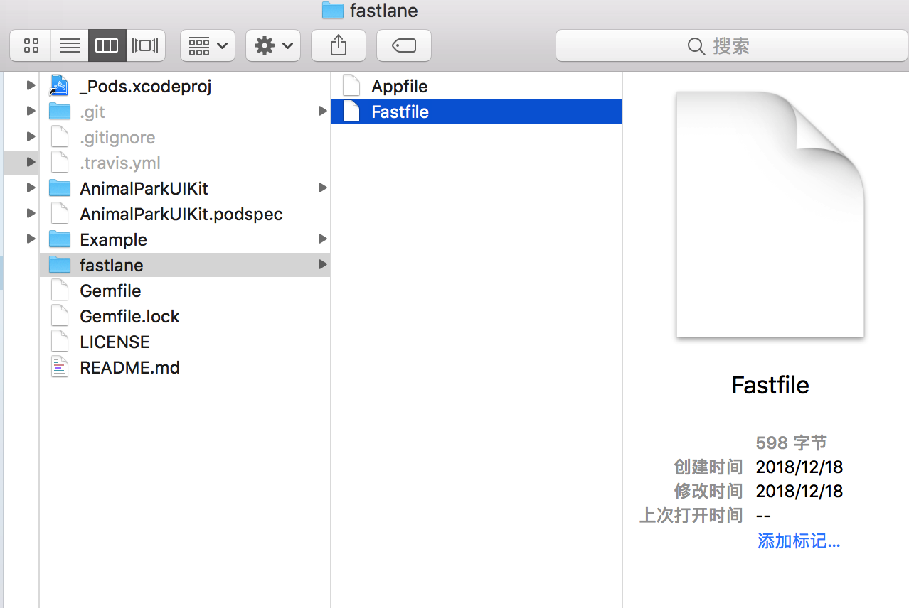
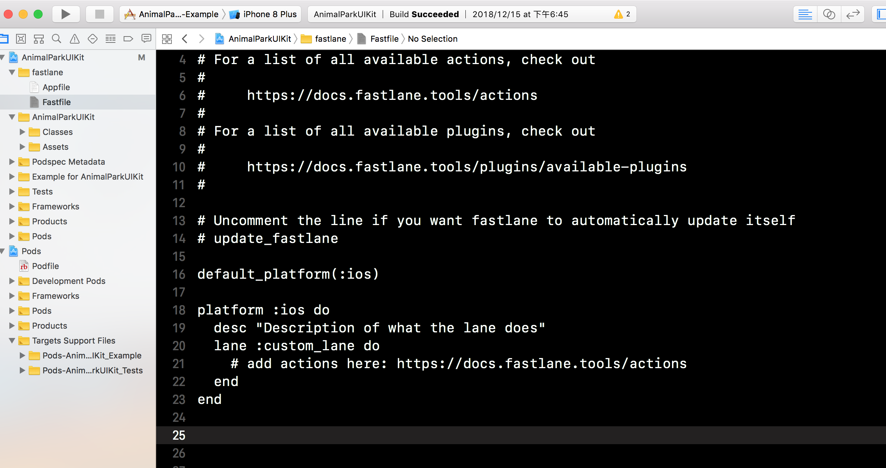
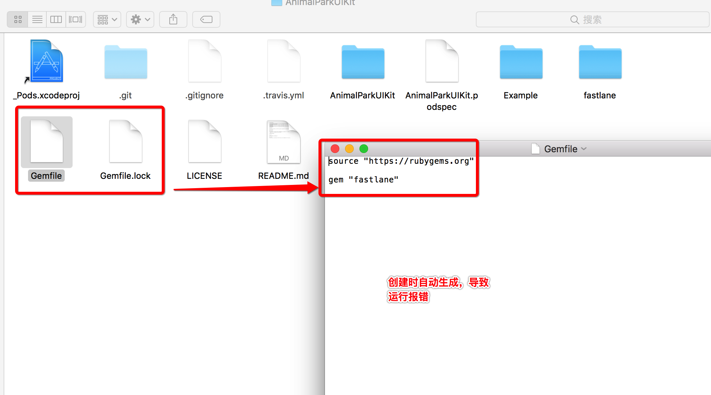
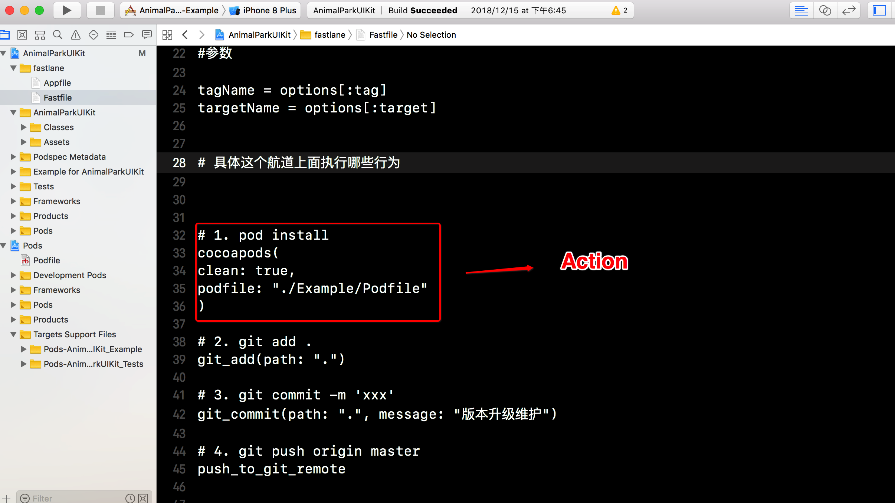
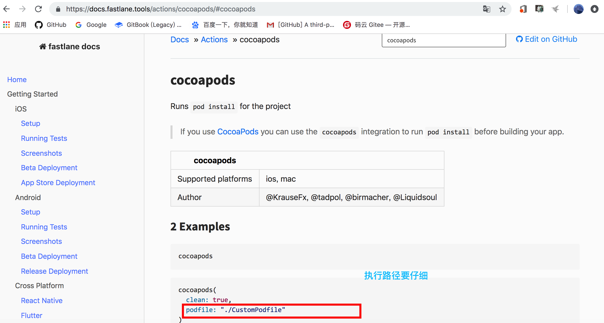
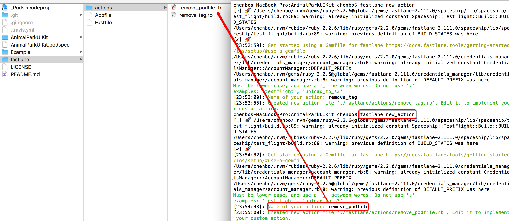

# 9.4 自动化-私有库自动化


## 库代码自动化缘由  

私有库开发中伴随一些列的重复性操作，重复的命令行耗时费力

* Cocoapods操作 pod install

* Git 操作 提交代码打标签

* Cocoapods操作验证以及提交发布


## 基于Fastlane 的自动化生产私有库


* cd 已有项目 AnimalParkUIKit目录下, 执行

```
fastlane init

```

结果


```
chenbos-MacBook-Pro:AnimalParkUIKit chenbo$ fastlane init
[⠧] 🚀 /Users/chenbo/.rvm/gems/ruby-2.2.6@global/gems/fastlane-2.111.0/spaceship/lib/spaceship/test_flight/build.rb:89: warning: already initialized constant Spaceship::TestFlight::Build::BUILD_STATES
/Users/chenbo/.rvm/rubies/ruby-2.2.6/lib/ruby/gems/2.2.0/gems/fastlane-2.111.0/spaceship/lib/spaceship/test_flight/build.rb:89: warning: previous definition of BUILD_STATES was here
[✔] 🚀 
/Users/chenbo/.rvm/rubies/ruby-2.2.6/lib/ruby/gems/2.2.0/gems/fastlane-2.111.0/credentials_manager/lib/credentials_manager/account_manager.rb:8: warning: already initialized constant CredentialsManager::AccountManager::DEFAULT_PREFIX
/Users/chenbo/.rvm/gems/ruby-2.2.6@global/gems/fastlane-2.111.0/credentials_manager/lib/credentials_manager/account_manager.rb:8: warning: previous definition of DEFAULT_PREFIX was here
[22:20:37]: Sending anonymous analytics information
[22:20:37]: Learn more at https://docs.fastlane.tools/#metrics
[22:20:37]: No personal or sensitive data is sent.
[22:20:37]: You can disable this by adding `opt_out_usage` at the top of your Fastfile
[✔] Looking for iOS and Android projects in current directory...
[22:20:37]: Created new folder './fastlane'.
[22:20:37]: Detected an iOS/macOS project in the current directory: '_Pods.xcodeproj'
/Users/chenbo/.rvm/gems/ruby-2.2.6@global/gems/fastlane-2.111.0/spaceship/lib/spaceship/portal/certificate.rb:150: warning: already initialized constant Spaceship::Portal::Certificate::IOS_CERTIFICATE_TYPE_IDS
/Users/chenbo/.rvm/rubies/ruby-2.2.6/lib/ruby/gems/2.2.0/gems/fastlane-2.111.0/spaceship/lib/spaceship/portal/certificate.rb:150: warning: previous definition of IOS_CERTIFICATE_TYPE_IDS was here
/Users/chenbo/.rvm/gems/ruby-2.2.6@global/gems/fastlane-2.111.0/spaceship/lib/spaceship/portal/certificate.rb:164: warning: already initialized constant Spaceship::Portal::Certificate::OLDER_IOS_CERTIFICATE_TYPES
/Users/chenbo/.rvm/rubies/ruby-2.2.6/lib/ruby/gems/2.2.0/gems/fastlane-2.111.0/spaceship/lib/spaceship/portal/certificate.rb:164: warning: previous definition of OLDER_IOS_CERTIFICATE_TYPES was here
/Users/chenbo/.rvm/gems/ruby-2.2.6@global/gems/fastlane-2.111.0/spaceship/lib/spaceship/portal/certificate.rb:174: warning: already initialized constant Spaceship::Portal::Certificate::MAC_CERTIFICATE_TYPE_IDS
/Users/chenbo/.rvm/rubies/ruby-2.2.6/lib/ruby/gems/2.2.0/gems/fastlane-2.111.0/spaceship/lib/spaceship/portal/certificate.rb:174: warning: previous definition of MAC_CERTIFICATE_TYPE_IDS was here
/Users/chenbo/.rvm/gems/ruby-2.2.6@global/gems/fastlane-2.111.0/spaceship/lib/spaceship/portal/certificate.rb:185: warning: already initialized constant Spaceship::Portal::Certificate::CERTIFICATE_TYPE_IDS
/Users/chenbo/.rvm/rubies/ruby-2.2.6/lib/ruby/gems/2.2.0/gems/fastlane-2.111.0/spaceship/lib/spaceship/portal/certificate.rb:185: warning: previous definition of CERTIFICATE_TYPE_IDS was here
/Users/chenbo/.rvm/gems/ruby-2.2.6@global/gems/fastlane-2.111.0/spaceship/lib/spaceship/portal/portal_client.rb:21: warning: already initialized constant Spaceship::PortalClient::PROTOCOL_VERSION
/Users/chenbo/.rvm/rubies/ruby-2.2.6/lib/ruby/gems/2.2.0/gems/fastlane-2.111.0/spaceship/lib/spaceship/portal/portal_client.rb:21: warning: previous definition of PROTOCOL_VERSION was here
/Users/chenbo/.rvm/rubies/ruby-2.2.6/lib/ruby/gems/2.2.0/gems/fastlane-2.111.0/spaceship/lib/spaceship/portal/app_service.rb:43: warning: already initialized constant Spaceship::Portal::AppService::AccessWiFi
/Users/chenbo/.rvm/gems/ruby-2.2.6@global/gems/fastlane-2.111.0/spaceship/lib/spaceship/portal/app_service.rb:43: warning: previous definition of AccessWiFi was here
/Users/chenbo/.rvm/rubies/ruby-2.2.6/lib/ruby/gems/2.2.0/gems/fastlane-2.111.0/spaceship/lib/spaceship/portal/app_service.rb:44: warning: already initialized constant Spaceship::Portal::AppService::AppGroup
/Users/chenbo/.rvm/gems/ruby-2.2.6@global/gems/fastlane-2.111.0/spaceship/lib/spaceship/portal/app_service.rb:44: warning: previous definition of AppGroup was here
/Users/chenbo/.rvm/rubies/ruby-2.2.6/lib/ruby/gems/2.2.0/gems/fastlane-2.111.0/spaceship/lib/spaceship/portal/app_service.rb:45: warning: already initialized constant Spaceship::Portal::AppService::ApplePay
/Users/chenbo/.rvm/gems/ruby-2.2.6@global/gems/fastlane-2.111.0/spaceship/lib/spaceship/portal/app_service.rb:45: warning: previous definition of ApplePay was here
/Users/chenbo/.rvm/rubies/ruby-2.2.6/lib/ruby/gems/2.2.0/gems/fastlane-2.111.0/spaceship/lib/spaceship/portal/app_service.rb:46: warning: already initialized constant Spaceship::Portal::AppService::AssociatedDomains
/Users/chenbo/.rvm/gems/ruby-2.2.6@global/gems/fastlane-2.111.0/spaceship/lib/spaceship/portal/app_service.rb:46: warning: previous definition of AssociatedDomains was here
/Users/chenbo/.rvm/rubies/ruby-2.2.6/lib/ruby/gems/2.2.0/gems/fastlane-2.111.0/spaceship/lib/spaceship/portal/app_service.rb:47: warning: already initialized constant Spaceship::Portal::AppService::ClassKit
/Users/chenbo/.rvm/gems/ruby-2.2.6@global/gems/fastlane-2.111.0/spaceship/lib/spaceship/portal/app_service.rb:47: warning: previous definition of ClassKit was here
/Users/chenbo/.rvm/rubies/ruby-2.2.6/lib/ruby/gems/2.2.0/gems/fastlane-2.111.0/spaceship/lib/spaceship/portal/app_service.rb:48: warning: already initialized constant Spaceship::Portal::AppService::AutoFillCredential
/Users/chenbo/.rvm/gems/ruby-2.2.6@global/gems/fastlane-2.111.0/spaceship/lib/spaceship/portal/app_service.rb:48: warning: previous definition of AutoFillCredential was here
/Users/chenbo/.rvm/rubies/ruby-2.2.6/lib/ruby/gems/2.2.0/gems/fastlane-2.111.0/spaceship/lib/spaceship/portal/app_service.rb:49: warning: already initialized constant Spaceship::Portal::AppService::DataProtection
/Users/chenbo/.rvm/gems/ruby-2.2.6@global/gems/fastlane-2.111.0/spaceship/lib/spaceship/portal/app_service.rb:49: warning: previous definition of DataProtection was here
/Users/chenbo/.rvm/rubies/ruby-2.2.6/lib/ruby/gems/2.2.0/gems/fastlane-2.111.0/spaceship/lib/spaceship/portal/app_service.rb:50: warning: already initialized constant Spaceship::Portal::AppService::GameCenter
/Users/chenbo/.rvm/gems/ruby-2.2.6@global/gems/fastlane-2.111.0/spaceship/lib/spaceship/portal/app_service.rb:50: warning: previous definition of GameCenter was here
/Users/chenbo/.rvm/rubies/ruby-2.2.6/lib/ruby/gems/2.2.0/gems/fastlane-2.111.0/spaceship/lib/spaceship/portal/app_service.rb:51: warning: already initialized constant Spaceship::Portal::AppService::HealthKit
/Users/chenbo/.rvm/gems/ruby-2.2.6@global/gems/fastlane-2.111.0/spaceship/lib/spaceship/portal/app_service.rb:51: warning: previous definition of HealthKit was here
/Users/chenbo/.rvm/rubies/ruby-2.2.6/lib/ruby/gems/2.2.0/gems/fastlane-2.111.0/spaceship/lib/spaceship/portal/app_service.rb:52: warning: already initialized constant Spaceship::Portal::AppService::HomeKit
/Users/chenbo/.rvm/gems/ruby-2.2.6@global/gems/fastlane-2.111.0/spaceship/lib/spaceship/portal/app_service.rb:52: warning: previous definition of HomeKit was here
/Users/chenbo/.rvm/rubies/ruby-2.2.6/lib/ruby/gems/2.2.0/gems/fastlane-2.111.0/spaceship/lib/spaceship/portal/app_service.rb:53: warning: already initialized constant Spaceship::Portal::AppService::Hotspot
/Users/chenbo/.rvm/gems/ruby-2.2.6@global/gems/fastlane-2.111.0/spaceship/lib/spaceship/portal/app_service.rb:53: warning: previous definition of Hotspot was here
/Users/chenbo/.rvm/rubies/ruby-2.2.6/lib/ruby/gems/2.2.0/gems/fastlane-2.111.0/spaceship/lib/spaceship/portal/app_service.rb:54: warning: already initialized constant Spaceship::Portal::AppService::Cloud
/Users/chenbo/.rvm/gems/ruby-2.2.6@global/gems/fastlane-2.111.0/spaceship/lib/spaceship/portal/app_service.rb:54: warning: previous definition of Cloud was here
/Users/chenbo/.rvm/rubies/ruby-2.2.6/lib/ruby/gems/2.2.0/gems/fastlane-2.111.0/spaceship/lib/spaceship/portal/app_service.rb:55: warning: already initialized constant Spaceship::Portal::AppService::CloudKit
/Users/chenbo/.rvm/gems/ruby-2.2.6@global/gems/fastlane-2.111.0/spaceship/lib/spaceship/portal/app_service.rb:55: warning: previous definition of CloudKit was here
/Users/chenbo/.rvm/rubies/ruby-2.2.6/lib/ruby/gems/2.2.0/gems/fastlane-2.111.0/spaceship/lib/spaceship/portal/app_service.rb:56: warning: already initialized constant Spaceship::Portal::AppService::InAppPurchase
/Users/chenbo/.rvm/gems/ruby-2.2.6@global/gems/fastlane-2.111.0/spaceship/lib/spaceship/portal/app_service.rb:56: warning: previous definition of InAppPurchase was here
/Users/chenbo/.rvm/rubies/ruby-2.2.6/lib/ruby/gems/2.2.0/gems/fastlane-2.111.0/spaceship/lib/spaceship/portal/app_service.rb:57: warning: already initialized constant Spaceship::Portal::AppService::InterAppAudio
/Users/chenbo/.rvm/gems/ruby-2.2.6@global/gems/fastlane-2.111.0/spaceship/lib/spaceship/portal/app_service.rb:57: warning: previous definition of InterAppAudio was here
/Users/chenbo/.rvm/rubies/ruby-2.2.6/lib/ruby/gems/2.2.0/gems/fastlane-2.111.0/spaceship/lib/spaceship/portal/app_service.rb:58: warning: already initialized constant Spaceship::Portal::AppService::Multipath
/Users/chenbo/.rvm/gems/ruby-2.2.6@global/gems/fastlane-2.111.0/spaceship/lib/spaceship/portal/app_service.rb:58: warning: previous definition of Multipath was here
/Users/chenbo/.rvm/rubies/ruby-2.2.6/lib/ruby/gems/2.2.0/gems/fastlane-2.111.0/spaceship/lib/spaceship/portal/app_service.rb:59: warning: already initialized constant Spaceship::Portal::AppService::NetworkExtension
/Users/chenbo/.rvm/gems/ruby-2.2.6@global/gems/fastlane-2.111.0/spaceship/lib/spaceship/portal/app_service.rb:59: warning: previous definition of NetworkExtension was here
/Users/chenbo/.rvm/rubies/ruby-2.2.6/lib/ruby/gems/2.2.0/gems/fastlane-2.111.0/spaceship/lib/spaceship/portal/app_service.rb:60: warning: already initialized constant Spaceship::Portal::AppService::NFCTagReading
/Users/chenbo/.rvm/gems/ruby-2.2.6@global/gems/fastlane-2.111.0/spaceship/lib/spaceship/portal/app_service.rb:60: warning: previous definition of NFCTagReading was here
/Users/chenbo/.rvm/rubies/ruby-2.2.6/lib/ruby/gems/2.2.0/gems/fastlane-2.111.0/spaceship/lib/spaceship/portal/app_service.rb:61: warning: already initialized constant Spaceship::Portal::AppService::PersonalVPN
/Users/chenbo/.rvm/gems/ruby-2.2.6@global/gems/fastlane-2.111.0/spaceship/lib/spaceship/portal/app_service.rb:61: warning: previous definition of PersonalVPN was here
/Users/chenbo/.rvm/rubies/ruby-2.2.6/lib/ruby/gems/2.2.0/gems/fastlane-2.111.0/spaceship/lib/spaceship/portal/app_service.rb:62: warning: already initialized constant Spaceship::Portal::AppService::Passbook
/Users/chenbo/.rvm/gems/ruby-2.2.6@global/gems/fastlane-2.111.0/spaceship/lib/spaceship/portal/app_service.rb:62: warning: previous definition of Passbook was here
/Users/chenbo/.rvm/rubies/ruby-2.2.6/lib/ruby/gems/2.2.0/gems/fastlane-2.111.0/spaceship/lib/spaceship/portal/app_service.rb:63: warning: already initialized constant Spaceship::Portal::AppService::PushNotification
/Users/chenbo/.rvm/gems/ruby-2.2.6@global/gems/fastlane-2.111.0/spaceship/lib/spaceship/portal/app_service.rb:63: warning: previous definition of PushNotification was here
/Users/chenbo/.rvm/rubies/ruby-2.2.6/lib/ruby/gems/2.2.0/gems/fastlane-2.111.0/spaceship/lib/spaceship/portal/app_service.rb:64: warning: already initialized constant Spaceship::Portal::AppService::SiriKit
/Users/chenbo/.rvm/gems/ruby-2.2.6@global/gems/fastlane-2.111.0/spaceship/lib/spaceship/portal/app_service.rb:64: warning: previous definition of SiriKit was here
/Users/chenbo/.rvm/rubies/ruby-2.2.6/lib/ruby/gems/2.2.0/gems/fastlane-2.111.0/spaceship/lib/spaceship/portal/app_service.rb:65: warning: already initialized constant Spaceship::Portal::AppService::VPNConfiguration
/Users/chenbo/.rvm/gems/ruby-2.2.6@global/gems/fastlane-2.111.0/spaceship/lib/spaceship/portal/app_service.rb:65: warning: previous definition of VPNConfiguration was here
/Users/chenbo/.rvm/rubies/ruby-2.2.6/lib/ruby/gems/2.2.0/gems/fastlane-2.111.0/spaceship/lib/spaceship/portal/app_service.rb:66: warning: already initialized constant Spaceship::Portal::AppService::Wallet
/Users/chenbo/.rvm/gems/ruby-2.2.6@global/gems/fastlane-2.111.0/spaceship/lib/spaceship/portal/app_service.rb:66: warning: previous definition of Wallet was here
/Users/chenbo/.rvm/rubies/ruby-2.2.6/lib/ruby/gems/2.2.0/gems/fastlane-2.111.0/spaceship/lib/spaceship/portal/app_service.rb:67: warning: already initialized constant Spaceship::Portal::AppService::WirelessAccessory
/Users/chenbo/.rvm/gems/ruby-2.2.6@global/gems/fastlane-2.111.0/spaceship/lib/spaceship/portal/app_service.rb:67: warning: previous definition of WirelessAccessory was here
/Users/chenbo/.rvm/gems/ruby-2.2.6@global/gems/fastlane-2.111.0/spaceship/lib/spaceship/tunes/iap_status.rb:8: warning: already initialized constant Spaceship::Tunes::IAPStatus::MISSING_METADATA
/Users/chenbo/.rvm/rubies/ruby-2.2.6/lib/ruby/gems/2.2.0/gems/fastlane-2.111.0/spaceship/lib/spaceship/tunes/iap_status.rb:8: warning: previous definition of MISSING_METADATA was here
/Users/chenbo/.rvm/gems/ruby-2.2.6@global/gems/fastlane-2.111.0/spaceship/lib/spaceship/tunes/iap_status.rb:11: warning: already initialized constant Spaceship::Tunes::IAPStatus::READY_TO_SUBMIT
/Users/chenbo/.rvm/rubies/ruby-2.2.6/lib/ruby/gems/2.2.0/gems/fastlane-2.111.0/spaceship/lib/spaceship/tunes/iap_status.rb:11: warning: previous definition of READY_TO_SUBMIT was here
/Users/chenbo/.rvm/gems/ruby-2.2.6@global/gems/fastlane-2.111.0/spaceship/lib/spaceship/tunes/iap_status.rb:14: warning: already initialized constant Spaceship::Tunes::IAPStatus::WAITING_FOR_REVIEW
/Users/chenbo/.rvm/rubies/ruby-2.2.6/lib/ruby/gems/2.2.0/gems/fastlane-2.111.0/spaceship/lib/spaceship/tunes/iap_status.rb:14: warning: previous definition of WAITING_FOR_REVIEW was here
/Users/chenbo/.rvm/gems/ruby-2.2.6@global/gems/fastlane-2.111.0/spaceship/lib/spaceship/tunes/iap_status.rb:17: warning: already initialized constant Spaceship::Tunes::IAPStatus::IN_REVIEW
/Users/chenbo/.rvm/rubies/ruby-2.2.6/lib/ruby/gems/2.2.0/gems/fastlane-2.111.0/spaceship/lib/spaceship/tunes/iap_status.rb:17: warning: previous definition of IN_REVIEW was here
/Users/chenbo/.rvm/gems/ruby-2.2.6@global/gems/fastlane-2.111.0/spaceship/lib/spaceship/tunes/iap_status.rb:20: warning: already initialized constant Spaceship::Tunes::IAPStatus::APPROVED
/Users/chenbo/.rvm/rubies/ruby-2.2.6/lib/ruby/gems/2.2.0/gems/fastlane-2.111.0/spaceship/lib/spaceship/tunes/iap_status.rb:20: warning: previous definition of APPROVED was here
/Users/chenbo/.rvm/gems/ruby-2.2.6@global/gems/fastlane-2.111.0/spaceship/lib/spaceship/tunes/iap_status.rb:23: warning: already initialized constant Spaceship::Tunes::IAPStatus::DELETED
/Users/chenbo/.rvm/rubies/ruby-2.2.6/lib/ruby/gems/2.2.0/gems/fastlane-2.111.0/spaceship/lib/spaceship/tunes/iap_status.rb:23: warning: previous definition of DELETED was here
/Users/chenbo/.rvm/gems/ruby-2.2.6@global/gems/fastlane-2.111.0/spaceship/lib/spaceship/tunes/iap_status.rb:26: warning: already initialized constant Spaceship::Tunes::IAPStatus::REJECTED
/Users/chenbo/.rvm/rubies/ruby-2.2.6/lib/ruby/gems/2.2.0/gems/fastlane-2.111.0/spaceship/lib/spaceship/tunes/iap_status.rb:26: warning: previous definition of REJECTED was here
/Users/chenbo/.rvm/gems/ruby-2.2.6@global/gems/fastlane-2.111.0/spaceship/lib/spaceship/tunes/iap_status.rb:29: warning: already initialized constant Spaceship::Tunes::IAPStatus::DEVELOPER_REMOVED_FROM_SALE
/Users/chenbo/.rvm/rubies/ruby-2.2.6/lib/ruby/gems/2.2.0/gems/fastlane-2.111.0/spaceship/lib/spaceship/tunes/iap_status.rb:29: warning: previous definition of DEVELOPER_REMOVED_FROM_SALE was here
/Users/chenbo/.rvm/gems/ruby-2.2.6@global/gems/fastlane-2.111.0/spaceship/lib/spaceship/tunes/iap_type.rb:7: warning: already initialized constant Spaceship::Tunes::IAPType::CONSUMABLE
/Users/chenbo/.rvm/rubies/ruby-2.2.6/lib/ruby/gems/2.2.0/gems/fastlane-2.111.0/spaceship/lib/spaceship/tunes/iap_type.rb:7: warning: previous definition of CONSUMABLE was here
/Users/chenbo/.rvm/gems/ruby-2.2.6@global/gems/fastlane-2.111.0/spaceship/lib/spaceship/tunes/iap_type.rb:8: warning: already initialized constant Spaceship::Tunes::IAPType::NON_CONSUMABLE
/Users/chenbo/.rvm/rubies/ruby-2.2.6/lib/ruby/gems/2.2.0/gems/fastlane-2.111.0/spaceship/lib/spaceship/tunes/iap_type.rb:8: warning: previous definition of NON_CONSUMABLE was here
/Users/chenbo/.rvm/gems/ruby-2.2.6@global/gems/fastlane-2.111.0/spaceship/lib/spaceship/tunes/iap_type.rb:9: warning: already initialized constant Spaceship::Tunes::IAPType::RECURRING
/Users/chenbo/.rvm/rubies/ruby-2.2.6/lib/ruby/gems/2.2.0/gems/fastlane-2.111.0/spaceship/lib/spaceship/tunes/iap_type.rb:9: warning: previous definition of RECURRING was here
/Users/chenbo/.rvm/gems/ruby-2.2.6@global/gems/fastlane-2.111.0/spaceship/lib/spaceship/tunes/iap_type.rb:10: warning: already initialized constant Spaceship::Tunes::IAPType::NON_RENEW_SUBSCRIPTION
/Users/chenbo/.rvm/rubies/ruby-2.2.6/lib/ruby/gems/2.2.0/gems/fastlane-2.111.0/spaceship/lib/spaceship/tunes/iap_type.rb:10: warning: previous definition of NON_RENEW_SUBSCRIPTION was here
/Users/chenbo/.rvm/gems/ruby-2.2.6@global/gems/fastlane-2.111.0/spaceship/lib/spaceship/tunes/iap_type.rb:13: warning: already initialized constant Spaceship::Tunes::IAPType::READABLE_CONSUMABLE
/Users/chenbo/.rvm/rubies/ruby-2.2.6/lib/ruby/gems/2.2.0/gems/fastlane-2.111.0/spaceship/lib/spaceship/tunes/iap_type.rb:13: warning: previous definition of READABLE_CONSUMABLE was here
/Users/chenbo/.rvm/gems/ruby-2.2.6@global/gems/fastlane-2.111.0/spaceship/lib/spaceship/tunes/iap_type.rb:16: warning: already initialized constant Spaceship::Tunes::IAPType::READABLE_NON_CONSUMABLE
/Users/chenbo/.rvm/rubies/ruby-2.2.6/lib/ruby/gems/2.2.0/gems/fastlane-2.111.0/spaceship/lib/spaceship/tunes/iap_type.rb:16: warning: previous definition of READABLE_NON_CONSUMABLE was here
/Users/chenbo/.rvm/gems/ruby-2.2.6@global/gems/fastlane-2.111.0/spaceship/lib/spaceship/tunes/iap_type.rb:19: warning: already initialized constant Spaceship::Tunes::IAPType::READABLE_AUTO_RENEWABLE_SUBSCRIPTION
/Users/chenbo/.rvm/rubies/ruby-2.2.6/lib/ruby/gems/2.2.0/gems/fastlane-2.111.0/spaceship/lib/spaceship/tunes/iap_type.rb:19: warning: previous definition of READABLE_AUTO_RENEWABLE_SUBSCRIPTION was here
/Users/chenbo/.rvm/gems/ruby-2.2.6@global/gems/fastlane-2.111.0/spaceship/lib/spaceship/tunes/iap_type.rb:22: warning: already initialized constant Spaceship::Tunes::IAPType::READABLE_NON_RENEWING_SUBSCRIPTION
/Users/chenbo/.rvm/rubies/ruby-2.2.6/lib/ruby/gems/2.2.0/gems/fastlane-2.111.0/spaceship/lib/spaceship/tunes/iap_type.rb:22: warning: previous definition of READABLE_NON_RENEWING_SUBSCRIPTION was here
[22:20:38]: -----------------------------
[22:20:38]: --- Welcome to fastlane 🚀 ---
[22:20:38]: -----------------------------
[22:20:38]: fastlane can help you with all kinds of automation for your mobile app
[22:20:38]: We recommend automating one task first, and then gradually automating more over time
[22:20:38]: What would you like to use fastlane for?
1. 📸  Automate screenshots
2. 👩‍✈️  Automate beta distribution to TestFlight
3. 🚀  Automate App Store distribution
4. 🛠  Manual setup - manually setup your project to automate your tasks
?  4
[22:20:50]: ------------------------------------------------------------
[22:20:50]: --- Setting up fastlane so you can manually configure it ---
[22:20:50]: ------------------------------------------------------------
[22:20:50]: Installing dependencies for you...
[22:20:50]: $ bundle update
[22:24:10]: --------------------------------------------------------
[22:24:10]: --- ✅  Successfully generated fastlane configuration ---
[22:24:10]: --------------------------------------------------------
[22:24:10]: Generated Fastfile at path `./fastlane/Fastfile`
[22:24:10]: Generated Appfile at path `./fastlane/Appfile`
[22:24:10]: Gemfile and Gemfile.lock at path `Gemfile`
[22:24:10]: Please check the newly generated configuration files into git along with your project
[22:24:10]: This way everyone in your team can benefit from your fastlane setup
[22:24:10]: Continue by pressing Enter ⏎

[22:24:20]: fastlane will collect the number of errors for each action to detect integration issues
[22:24:20]: No sensitive/private information will be uploaded, more information: https://docs.fastlane.tools/#metrics
[22:24:20]: ----------------------
[22:24:20]: --- fastlane lanes ---
[22:24:20]: ----------------------
[22:24:20]: fastlane uses a `Fastfile` to store the automation configuration
[22:24:20]: Within that, you'll see different lanes.
[22:24:20]: Each is there to automate a different task, like screenshots, code signing, or pushing new releases
[22:24:20]: Continue by pressing Enter ⏎

[22:24:28]: --------------------------------------
[22:24:28]: --- How to customize your Fastfile ---
[22:24:28]: --------------------------------------
[22:24:28]: Use a text editor of your choice to open the newly created Fastfile and take a look
[22:24:28]: You can now edit the available lanes and actions to customize the setup to fit your needs
[22:24:28]: To get a list of all the available actions, open https://docs.fastlane.tools/actions
[22:24:28]: Continue by pressing Enter ⏎

[22:24:33]: ------------------------------
[22:24:33]: --- Where to go from here? ---
[22:24:33]: ------------------------------
[22:24:33]: 📸  Learn more about how to automatically generate localized App Store screenshots:
[22:24:33]: 		https://docs.fastlane.tools/getting-started/ios/screenshots/
[22:24:33]: 👩‍✈️  Learn more about distribution to beta testing services:
[22:24:33]: 		https://docs.fastlane.tools/getting-started/ios/beta-deployment/
[22:24:33]: 🚀  Learn more about how to automate the App Store release process:
[22:24:33]: 		https://docs.fastlane.tools/getting-started/ios/appstore-deployment/
[22:24:33]: 👩‍⚕️  Learn more about how to setup code signing with fastlane
[22:24:33]: 		https://docs.fastlane.tools/codesigning/getting-started/
[22:24:33]: 
[22:24:33]: To try your new fastlane setup, just enter and run
[22:24:33]: $ fastlane custom_lane
chenbos-MacBook-Pro:AnimalParkUIKit chenbo$ 


```

* 工程目录结构




## lane  航道  

* 查看fastlane 命令

```
fastlane --help

```

```
 Commands: (* default)
    action                 Shows more information for a specific command
    actions                Lists all available fastlane actions
    add_plugin             Add a new plugin to your fastlane setup
    docs                   Generate a markdown based documentation based on
the Fastfile
    enable_auto_complete   Enable tab auto completion
    env                    Print your fastlane environment, use this when
you submit an issue on GitHub
    help                   Display global or [command] help documentation
    init                   Helps you with your initial fastlane setup
    install_plugins        Install all plugins for this project
    lanes                  Lists all available lanes and shows their
description


```


* 打开工程中 fastlane/Fastfile



* 编辑Fastfile 文件

```
desc 'BeiChenManagerPodCommit 使用这个航道, 可以快速的对自己的私有库, 进行升级维护'
lane :BeiChenManagerPodCommit do |options|


#参数

tagName = options[:tag]
targetName = options[:target]


# 具体这个航道上面执行哪些行为


# 1. pod install
cocoapods(
clean: true,
podfile: "./Example/Podfile"
)

# 2. git add .
git_add(path: ".")

# 3. git commit -m 'xxx'
git_commit(path: ".", message: "版本升级维护")

# 4. git push origin master
push_to_git_remote


# 4. git tag 标签名称
add_git_tag(
tag: tagName
)
#5. git push --tags
push_git_tags

# 6. pod spec lint
pod_lib_lint(allow_warnings: true)

#7.pod repo push XXXX xxx.podspec
pod_push(path: "#{targetName}.podspec", repo: "BeiChenSpecs", allow_warnings: true)


end

```

* 查验是否有效

```
fastlane lanes

```

```
[⠦] 🚀 /Users/chenbo/.rvm/gems/ruby-2.2.6@global/gems/fastlane-2.111.0/spaceship/lib/spaceship/test_flight/build.rb:89: warning: already initialized constant Spaceship::TestFlight::Build::BUILD_STATES
/Users/chenbo/.rvm/rubies/ruby-2.2.6/lib/ruby/gems/2.2.0/gems/fastlane-2.111.0/spaceship/lib/spaceship/test_flight/build.rb:89: warning: previous definition of BUILD_STATES was here
[✔] 🚀 
/Users/chenbo/.rvm/rubies/ruby-2.2.6/lib/ruby/gems/2.2.0/gems/fastlane-2.111.0/credentials_manager/lib/credentials_manager/account_manager.rb:8: warning: already initialized constant CredentialsManager::AccountManager::DEFAULT_PREFIX
/Users/chenbo/.rvm/gems/ruby-2.2.6@global/gems/fastlane-2.111.0/credentials_manager/lib/credentials_manager/account_manager.rb:8: warning: previous definition of DEFAULT_PREFIX was here

--------- general---------
----- fastlane BeiChenManagerPodCommit
BeiChenManagerPodCommit 使用这个航道, 可以快速的对自己的私有库, 进行升级维护

```


* 尝试使用

```
fastlane BeiChenManagerPodCommit tag:0.2.0 target:AnimalParkUIKit

```


```
[⠧] 🚀 /Users/chenbo/.rvm/gems/ruby-2.2.6@global/gems/fastlane-2.111.0/spaceship/lib/spaceship/test_flight/build.rb:89: warning: already initialized constant Spaceship::TestFlight::Build::BUILD_STATES
/Users/chenbo/.rvm/rubies/ruby-2.2.6/lib/ruby/gems/2.2.0/gems/fastlane-2.111.0/spaceship/lib/spaceship/test_flight/build.rb:89: warning: previous definition of BUILD_STATES was here
[✔] 🚀 
/Users/chenbo/.rvm/rubies/ruby-2.2.6/lib/ruby/gems/2.2.0/gems/fastlane-2.111.0/credentials_manager/lib/credentials_manager/account_manager.rb:8: warning: already initialized constant CredentialsManager::AccountManager::DEFAULT_PREFIX
/Users/chenbo/.rvm/gems/ruby-2.2.6@global/gems/fastlane-2.111.0/credentials_manager/lib/credentials_manager/account_manager.rb:8: warning: previous definition of DEFAULT_PREFIX was here
[23:01:07]: Driving the lane 'BeiChenManagerPodCommit' 🚀
[23:01:07]: -----------------------
[23:01:07]: --- Step: cocoapods ---
[23:01:07]: -----------------------
[23:01:07]: Using deprecated option: '--clean' (true)
[23:01:07]: Missing gem 'cocoapods', please add the following to your local Gemfile:
[23:01:07]: 
[23:01:07]: ▸ gem "cocoapods"
[23:01:07]: 
+---------------+-------------------------+
|              Lane Context               |
+---------------+-------------------------+
| PLATFORM_NAME |                         |
| LANE_NAME     | BeiChenManagerPodCommit |
+---------------+-------------------------+
[23:01:07]: Add 'gem "cocoapods"' to your Gemfile and restart fastlane

+------+-----------+-------------+
|        fastlane summary        |
+------+-----------+-------------+
| Step | Action    | Time (in s) |
+------+-----------+-------------+
| 💥   | cocoapods | 0           |
+------+-----------+-------------+

[23:01:07]: fastlane finished with errors

[!] Add 'gem "cocoapods"' to your Gemfile and restart fastlane

```


* 方案- 查看文件 删除 ``Gemfile`` 后 尝试



```
chenbos-MacBook-Pro:AnimalParkUIKit chenbo$ fastlane BeiChenManagerPodCommit tag:0.2.0 target:AnimalParkUIKit
[⠧] 🚀 /Users/chenbo/.rvm/gems/ruby-2.2.6@global/gems/fastlane-2.111.0/spaceship/lib/spaceship/test_flight/build.rb:89: warning: already initialized constant Spaceship::TestFlight::Build::BUILD_STATES
/Users/chenbo/.rvm/rubies/ruby-2.2.6/lib/ruby/gems/2.2.0/gems/fastlane-2.111.0/spaceship/lib/spaceship/test_flight/build.rb:89: warning: previous definition of BUILD_STATES was here
[✔] 🚀 
[23:17:23]: Get started using a Gemfile for fastlane https://docs.fastlane.tools/getting-started/ios/setup/#use-a-gemfile
/Users/chenbo/.rvm/rubies/ruby-2.2.6/lib/ruby/gems/2.2.0/gems/fastlane-2.111.0/credentials_manager/lib/credentials_manager/account_manager.rb:8: warning: already initialized constant CredentialsManager::AccountManager::DEFAULT_PREFIX
/Users/chenbo/.rvm/gems/ruby-2.2.6@global/gems/fastlane-2.111.0/credentials_manager/lib/credentials_manager/account_manager.rb:8: warning: previous definition of DEFAULT_PREFIX was here
[23:17:24]: Driving the lane 'BeiChenManagerPodCommit' 🚀
[23:17:24]: -----------------------
[23:17:24]: --- Step: cocoapods ---
[23:17:24]: -----------------------
[23:17:24]: Using deprecated option: '--clean' (true)
[23:17:24]: $ cd './Example' && pod install
[23:17:25]: ▸ Analyzing dependencies
[23:17:25]: ▸ Fetching podspec for `AnimalParkUIKit` from `../`
[23:17:32]: ▸ Downloading dependencies
[23:17:32]: ▸ Using AFNetworking (3.2.1)
[23:17:32]: ▸ Installing AnimalParkUIKit 0.2.0 (was 0.1.0)
[23:17:32]: ▸ Using FBSnapshotTestCase (2.1.4)
[23:17:32]: ▸ Generating Pods project
[23:17:32]: ▸ Integrating client project
[23:17:32]: ▸ Sending stats
[23:17:32]: ▸ Pod installation complete! There are 3 dependencies from the Podfile and 3 total pods installed.
[23:17:32]: ▸ [!] Automatically assigning platform `ios` with version `8.0` on target `AnimalParkUIKit_Example` because no platform was specified. Please specify a platform for this target in your Podfile. See `https://guides.cocoapods.org/syntax/podfile.html#platform`.
[23:17:32]: ---------------------
[23:17:32]: --- Step: git_add ---
[23:17:32]: ---------------------
[23:17:32]: Successfully added "." 💾.
[23:17:32]: ------------------------
[23:17:32]: --- Step: git_commit ---
[23:17:32]: ------------------------
[23:17:32]: $ git commit -m \版\本\升\级\维\护 .
[23:17:32]: ▸ [master 7f4848a] 版本升级维护
[23:17:32]: ▸ 12 files changed, 682 insertions(+), 520 deletions(-)
[23:17:32]: ▸ create mode 100644 fastlane/Appfile
[23:17:32]: ▸ create mode 100644 fastlane/Fastfile
[23:17:32]: ▸ create mode 100644 fastlane/README.md
[23:17:32]: ▸ create mode 100644 fastlane/report.xml
[23:17:32]: Successfully committed "." 💾.
[23:17:32]: --------------------------------
[23:17:32]: --- Step: push_to_git_remote ---
[23:17:32]: --------------------------------
[23:17:32]: $ pwd
[23:17:32]: ▸ /Users/chenbo/Documents/Gitee/架构之书演示代码/AnimalParkUIKit的副本
[23:17:32]: $ git push origin master:master --tags
[23:17:34]: ▸ remote: Powered By Gitee.com
[23:17:34]: ▸ To https://gitee.com/dawuyu/AnimalParkUIKit.git
[23:17:34]: ▸ 8bcb63c..7f4848a  master -> master
[23:17:34]: Successfully pushed to remote.
[23:17:34]: -------------------------
[23:17:34]: --- Step: add_git_tag ---
[23:17:34]: -------------------------
[23:17:34]: Adding git tag '0.2.0' 🎯.
[23:17:34]: $ git tag -am 0.2.0\ \(fastlane\) 0.2.0
[23:17:34]: ---------------------------
[23:17:34]: --- Step: push_git_tags ---
[23:17:34]: ---------------------------
[23:17:34]: $ git push origin --tags
[23:17:37]: ▸ remote: Powered By Gitee.com
[23:17:37]: ▸ To https://gitee.com/dawuyu/AnimalParkUIKit.git
[23:17:37]: ▸ * [new tag]         0.2.0 -> 0.2.0
[23:17:37]: Tags pushed to remote
[23:17:37]: --------------------------
[23:17:37]: --- Step: pod_lib_lint ---
[23:17:37]: --------------------------
[23:17:37]: $ pod lib lint --allow-warnings
[23:17:52]: ▸  -> AnimalParkUIKit (0.2.0)
[23:17:52]: ▸ - WARN  | url: The URL (https://gitee.com/dawuyu/AnimalParkUIKit) is not reachable.
[23:17:52]: ▸ AnimalParkUIKit passed validation.
[23:17:52]: Pod lib lint Successfully ⬆️ 
[23:17:52]: ----------------------
[23:17:52]: --- Step: pod_push ---
[23:17:52]: ----------------------
[23:17:52]: $ pod repo push BeiChenSpecs 'AnimalParkUIKit.podspec' --allow-warnings
[23:17:54]: ▸ Validating spec
[23:18:06]: ▸  -> AnimalParkUIKit (0.2.0)
[23:18:06]: ▸ - WARN  | url: The URL (https://gitee.com/dawuyu/AnimalParkUIKit) is not reachable.
[23:18:06]: ▸ Updating the `BeiChenSpecs' repo
[23:18:07]: ▸ Already up to date.
[23:18:07]: ▸ Adding the spec to the `BeiChenSpecs' repo
[23:18:07]: ▸ - [Update] AnimalParkUIKit (0.2.0)
[23:18:07]: ▸ Pushing the `BeiChenSpecs' repo
[23:18:09]: Successfully pushed Podspec ⬆️ 

+------+--------------------+-------------+
|            fastlane summary             |
+------+--------------------+-------------+
| Step | Action             | Time (in s) |
+------+--------------------+-------------+
| 1    | cocoapods          | 7           |
| 2    | git_add            | 0           |
| 3    | git_commit         | 0           |
| 4    | push_to_git_remote | 2           |
| 5    | add_git_tag        | 0           |
| 6    | push_git_tags      | 3           |
| 7    | pod_lib_lint       | 15          |
| 8    | pod_push           | 16          |
+------+--------------------+-------------+

[23:18:09]: fastlane.tools finished successfully 🎉

```

* 方案二 查看文件 不删 ``Gemfile`` 后 编辑 后发现 tag重复

```
gem "cocoapods"

```


## Action 

* Action是Fastlane自动化流程中的最小执行单元，体现在Fastfile脚本中的一个个命令，比如：cocoapods, git_add等等，而这些命令背后都对应一个用Ruby编写的脚本。

* Action 文档链接 [文档](https://docs.fastlane.tools/actions/Actions/)

* Action 源码链接 [源码](https://github.com/fastlane/fastlane/tree/master/fastlane/lib/fastlane/actions)




### 编写官方文档已认证Action



### 其他已有Acton根据文档编辑


## 自定义Action

####  解决tag重复问题  添加删除 Action

```
desc 'BeiChenManagerPodCommit 使用这个航道, 可以快速的对自己的私有库, 进行升级维护'
lane :BeiChenManagerPodCommit do |options|


#参数

tagName = options[:tag]
targetName = options[:target]


# 具体这个航道上面执行哪些行为


# 1. pod install
cocoapods(
clean: true,
podfile: "./Example/Podfile"
)

# 2. git add .
git_add(path: ".")

# 3. git commit -m 'xxx'
git_commit(path: ".", message: "版本升级维护")

# 4. git push origin master
push_to_git_remote


# 验证tag是否存在,如果存在, 应该删除本地标签和远程标签
#if 判断标签是否存在
#    执行删除本地/远程标签
#end

if git_tag_exists(tag: tagName)
UI.message("发现tag:#{tagName} 已经存在, 即将执行, 删除动作 🚀")

#自定义删除标签 本地以及远程
#remove_tag(tag:tagName)

end


# 4. git tag 标签名称
add_git_tag(
tag: tagName
)
#5. git push --tags
push_git_tags

# 6. pod spec lint
pod_lib_lint(allow_warnings: true)

#7.pod repo push XXXX xxx.podspec
pod_push(path: "#{targetName}.podspec", repo: "BeiChenSpecs", allow_warnings: true)


end


```


### 自定义 Action 编写步骤

* 创建 自定义Action 创建脚本文件 以及 Action名称  `` fastlane new_action  ``





* 编写脚本文件

```
module Fastlane
  module Actions
    module SharedValues
      REMOVE_TAG_CUSTOM_VALUE = :REMOVE_TAG_CUSTOM_VALUE
    end

    class RemoveTagAction < Action
      def self.run(params)
      
      tagName = params[:tag]
      isRemoveLocalTag = params[:rL]
      isRemoveRemoteTag = params[:rR]
      
      # 1. 先定义一个数组, 用来存储所有需要执行的命令
      
      cmds = []
      
      # 2. 往数组里面, 添加相应的命令
      # 删除本地标签
      # git tag -d 标签名称
      if isRemoveLocalTag
        cmds << "git tag -d #{tagName} "
      end
    
      # 删除远程标签
      # git push origin :标签名称
      if isRemoveRemoteTag
        cmds << " git push origin :#{tagName}"
      end

      #3. 执行数组里面的所有命令
     
      result = Actions.sh(cmds.join('&'));
      return result
      end


      def self.description
        "恩, 牛逼"
      end

      def self.details
        # Optional:
        # this is your chance to provide a more detailed description of this action
        "我们可以使用这个action ,来删除本地或者远程标签"
      end

      def self.available_options
        # Define all options your action supports. 
        
        # Below a few examples
        [

                FastlaneCore::ConfigItem.new(key: :tag,
                                             description: "需要被删除的标签名称",
                                             optional: false,
                                             is_string: true),
                FastlaneCore::ConfigItem.new(key: :rL,
                                             description: "是否需要删除本地标签",
                                             optional: true,
                                             is_string: false,
                                             default_value: true),
                FastlaneCore::ConfigItem.new(key: :rR,
                                             description: "是否需要删除远程标签",
                                             optional: true,
                                             is_string: false,
                                             default_value: true)
        ]
      end

      def self.output

      end

      def self.return_value
        nil
      end

      def self.authors
        # So no one will ever forget your contribution to fastlane :) You are awesome btw!
        ["北辰"]
      end

      def self.is_supported?(platform)
        # you can do things like
        # 
        #  true
        # 
        #  platform == :ios
        # 
        #  [:ios, :mac].include?(platform)
        # 

        platform == :ios
      end
    end
  end
end


```


